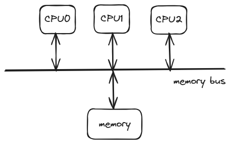
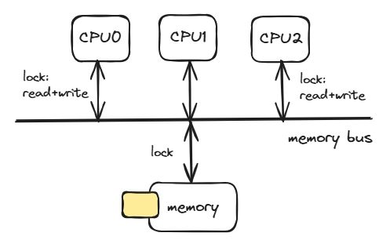
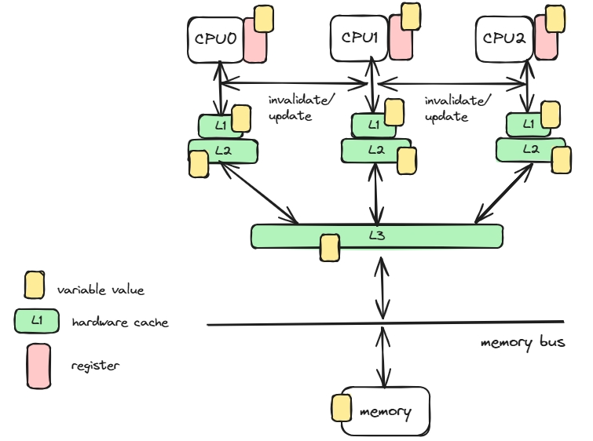

## 锁是什么

今天想讲一个考虑了很久的话题，**锁**。

在没有接触 linux 内核之前，我就一直很疑惑锁是什么。虽然对于锁的语义是很明确的，保护同一份数据被多个执行线程同时访问，避免数据竞争，甚至锁这个名称就很形象得表达了同一个时间段只有一个访问者。但是我还是很疑惑：

**锁是什么？**  
**如何从头实现锁？**

更进一步，我们平时编程中接触到的同步语义还有：

* 临界区是什么？
* 信号量是什么？
* 自旋锁是什么？
* 读写锁是什么？
* 数据库中的意向锁是什么？
* 原子变量是什么？
* 内存序是什么？
* 无锁队列是什么？
* 为什么无锁队列在`无锁`的情况下还可以满足并发访问的数据安全要求？
* 悲观锁是什么？
* 乐观锁是什么？
* 锁为什么可以拥有众多的变种？
* 锁一定要局限在操作系统内核中吗？

锁这个原语是我学习 linux 内核的另一个大收获，它满足了我的一大好奇心。

## 为什么需要锁

锁是为了并发同步安全诞生的语义。同步在编程领域有很多语义，在这里我们特指多个并发流同时操作同一份资源时，并发流间的有序操作，比如 A -> B -> A -> A -> B 这样的交替操作次序。更加形象得，你可以理解多个人试图进入同一个房间，为了满足任意时间点房间都只能有一个人的约束，可以要求每个人进入房间后对房间上锁，其他人就无法打开房门，直到房间内的人出来，解锁了门。

同步不是内核特有的需求，同步也不局限于单一对象或者对象的多副本。

对于数据并发访问的所有场景都需要同步才能保证数据安全。想象这样的场景：

```
define a=1;
thread1:  a=a+1;
thread2:  a=a+1;

理想的场景是：
thread1: a(2)=a(1)+1;
thread2: a(3)=a(2)+1;
a=3

实际可能的场景：
thread1: a(2)=a(1)+1;
thread2: a(2)=a(1)+1;
a=2 （更新丢失问题）
```

这个例子就是并发操作中的更新丢失问题，由于 thread1 和 thread2 同时读取到了 a=1 的旧值，导致其中一个数据更新丢失了。

这个场景并不是内核并发的场景，它是分布式环境下多 client 同时读写同一个变量的并发场景。在没有锁语义下，并发操作的结果偏离了开发者的预期。那我们加上一个exclusive 锁，比如：

```
define a=1;
thread1:  a=a+1;
thread2:  a=a+1;

operation sequence：
thread1:
1. read a with exclusive lock
2. write a=a+1
3. release exclusive lock
a=2

thread2:
1. read a with exclusive lock (wait untill unlock)
2. write a=a+1
3. release exclusive lock
a=3
```

通过加锁，我们实现了并发安全。

## 内核中的锁

上一小节我们从一个很宏观的角度阐述了并发领域锁这个原语，现在我们就要开启了**锁**这个原语在操作系统层面是怎么被实现出来的旅程啦。

它还有点复杂，涉及到操作系统的一些关键组件，所以我们要再往回走一点，走回对单个值的共识上。

锁最基础的部分是一种共识，只有多个并发实体对共同的东西达成一个共识时，才可能同步，比如只有所有人都认可门锁锁住不可以进入的时候，才能保证加锁的状态下只有一个人在房间中。

这个共识可以是多个状态值的认可，也可能只包含单个变量的认可。为了方便，我们对单个变量进行说明。

### 每 CPU 变量

最简单的共识就是，每个并发实体都拥有独立的 instance，这样就不用考虑同步问题了。

内核中就设置了每 CPU 变量，意思简单明了，该变量不会被多个 CPU 同时执行。比较有名的例子就是每 CPU 的 runqueue(进程运行队列)。

还有就是用户态下定义的线程本地变量：
```
_thread int a;
```
表达的也是一个意思，不同线程拥有不同的副本，虽然在定义上是相同的变量名，但是在不同线程内存中它们执行的不是同一份 int 类型内存。

### 原子变量

每 CPU 变量不用同步(但是要禁止内核抢占)，所以效率很高。但是总存在多个并发执行流同时访问一个变量的需求，就需要不同并发执行流对同一个值达成共识。比如设定 a=1 表示车位占用，a=0 表示车位空闲，当多个人需要停车时，查询到 a=1 时就要放弃；查询到 a=0 是就可以停车，并且把设置 a=1。

但是实际的情况还要更加复杂，因为这里单个操作涉及到 `读-修改-写` 的多步骤，要保证多个操作不出问题就要防止`读-修改-写`被交叉操作。

一个进一步的想法就是：是否有可能对一小块内存块规定，它的`读-修改-写`操作是原子的，不可分割的。这样并发执行流就能天然在这个内存块上串行操作了，因为它是最小的不可分割的操作单元。

这就是原子变量。

原子变量是内核提供的一种重要同步原语，几乎是其他所有同步原语和机制（不同类型的锁、信号量和无锁队列等）的基础。

原子变量中的`原子`表达的是数据`读-修改-写`不可分割的意思。由于不可分割，自然就不可能有其他操作在操作 A 的读之后，写之前再次读取变量的值，因为`读-修改-写`是不可分割的。

实现原子变量在操作系统中并不是那么 straightforward 的。比如我们考虑一个简单的模型---多 CPU + 单份主存。

为了在这个模型上实现原子变量，硬件上 CPU 和内存要支持锁总线的命令，避免多个 CPU 对同个内存块进行同时访问。


实际的计算机架构比这个复杂多了，基于效率考虑，为了避免快速 CPU 总是要访问慢速的主存，计算机增加了多级硬件缓存，按访问延迟依次是寄存器、CPU 专有的 L1/L2 硬件缓存，CPU 共享的 L3 硬件缓存，再到共享的物理内存。


在这个内存体系下，多个并发流对同一个变量的值达成共识变得非常困难，因为主存中的变量在不同层次的硬件缓存中都有一个缓存值。想要达成共识，也就要求如果 CPU0 update 变量值，
1. 要么 write through 回主存，然后发消息让其他 CPU 硬件缓存中的对应值失效，让其他 CPU 回主存重新取值，缓存。
2. 要么直接将 updated value 发给其他所有 CPU，更新它们硬件缓存中的对应值，等全部回应成功后才认为该 CPU 的写成功了。这样其他 CPU 也能直接读取到最新值。


以上两种方式就是平时提及的缓存一致性协议 MESI/MOESI 等的工作机制，都能让多个 CPU 都可以理解读取到最新值，从而能对同一个值达成共识。

如果你对数据库的复制机制和读写语义感兴趣的话，可以看到它们本质是一样的，在多副本下应该提供什么样的读写语义，数据库提供 stale read, read after write, atomicity consistency。而这个实现正是 atomicity consistency 或者说是 linearized consistency。

你以为上面的硬件架构是最终形态了？还不是！可能是觉得单个 write 等待所有 CPU ack 的时间太长了，影响 CPU 的效率，工程师又在 CPU 边上加上 store buffer 和 invalidate queue。write 不需要等待 invalidate ack 即可执行下个命令。将 invalidate 请求放入 invalidate queue 后，CPU 直接返回 ack，不需要等待 CPU 将 L1 对应缓存标记成失效。


在这个架构下，要多个 CPU 对同一个值达成共识已经很难了，因为 write 都不需要等 ack 确认就直接执行下个命令，那其他 CPU 必定会是 stale read，此时就无法对同一个值达成共识。这其实是一种 tradeoff，它假设在大多数场景下都不需要对同一个值达成共识，所以分级硬件缓存+store buffer+invalidate queue 可以对大多数场景进行性能加速。

对于少量的同步场景，这个架构下应该如何让多个 CPU 对同一个变量的值达成共识？


硬件系统层面对原子变量的操作语义支持是复杂的，我们可以想象的几个不一致的场景：
1. 变量内存不对齐 native word size，或者变量内存不在一次指令内存操作范围内，需要使用多个指令才能操作变量。多个 CPU 可能在指令之间交替执行，比如变量的前 8 字节和后 8 字节可能不在一个 context 操作。
2. 最简单的状态变更 a++ 需要的不是一个操作，而是 3 个操作，读取内存中 a 变量的值到寄存器，改寄存器，将寄存器的值回写内存。多个 CPU 可能在操作之间交替执行，比如导致更新丢失。
3. 在存储山结构中，部分存储是 CPU 专有的，比如寄存器/L1/L2，部分存储是 CPU 共享的，比如 L3/memory。对于共享存储，我们可以通过锁内存总线的方式串行化特定区域的内存访问，但是对于特有的存储，就可以存在有旧的变量值在硬件缓存中，CPU 误认为自己获取了最新的值。

因此，对于原子变量的实现，在系统层面上需要以下几种机制保证：  
1.1 架构相关实现下，变量需要对齐 native word size 实现单个`读` 或`写`变量的原子操作，比如 8 bytes 变量需要地址低 3 bit 都为 0。  
1.2 架构相关实现下，保证操作可以翻译成单个指令执行。  
2. 对于`读-修改-写`操作，共享型内存提供锁内存总线的方式串行化不同 CPU 的访问，比如 lock 指令。
3. 对于`读-修改-写`操作，独享型内存提供处理器间机制，比如 MESI protocol，保证同一变量的不同缓存状态能互相影响，比如将其他 CPU 的高速缓存标记成失效状态。

通过以上机制，内核对外提供了非常简单直观的原子变量语义，比如：
```
struct atomic_int {
    int v;  // 一小块内存对齐的内存
};

define global struct atomic_int count;

int main() {
    atomic_inc(&count);
}
```

可能对应的汇编：
```
lock addl	$1, count(%rip)   // 锁总线+标记其他高速缓存失效
```

内核提供一些原子操作如下：
```
atomic_read(v)                // Return *v
atomic_add(i,v)               // Add i to *v
atomic_sub_and_test(i, v)     // Subtract i from *v and return 1 if the result is zero; 0 otherwise
```

原子变量提供了非常可靠的同步原语，所有的`读`/`写`/`读-修改-写`在多处理器上被认为是 instantly 和 simutaneously 的。这样对于同一个原子变量，多处理在该原子变量上的操作被同步了，最终表现出 some order，比如：

define atomic_int v;

| ts      |  P1     |   P2   |    P3  |
|---------|---------|--------|--------|
| t1      | read v  |        |        |
| t2      |         |        |write v |
| t3      |         |r-m-w v |        |
| t4      | write v |        |        |

编程人员在原子操作的语义上可以自定义同步的各种操作，比如等待同步、自旋同步等等。

### 优化屏障和内存屏障
在原子变量的语义之外，我们要讨论一个更加深入处理器架构/编译优化/硬件缓存的多线程相关的问题--内存模型。

> 注意  
> 我们在编写 C++/Java 等多线程程序时，经常会碰到内存模型或者内存序相关的话题。要注意，内存模型更多是处理器架构/编译优化/硬件缓存等底层机制，语言层面的内存模型只是便于提高代码在不同处理器架构下的可移植性。

不同于原子变量讨论的是多处理器对于同一个地址的操作，内存模型讨论的是多处理器对于多个地址操作可见性顺序的问题，这个问题影响了多线程程序的正确性问题。举个例子：


对于这个代码片段，Flag1 和 Flag2 都声明为普通变量，有可能 P1 和 P2 都进入 critical section 吗？

站在编程者的角度看，不可能，因为：
1. 如果 P1 先进入 critical section，说明此时 Flag2 == 0，从而确定 P1 的 Flag1 已经执行了，同时 P2 的 Flag2=1 未执行。所以当 P2 判断 if(Flag1==0) 必为 false。  
2. 如果 P2 先进入 critical section，和 a 类似推理。  
3. P1 和 P2 交替执行，都不进入 critical section。

仔细分析`编程者的角度`，可以知道这种直接简单并且非常符合编程者直觉的角度，其实隐含了以下几个含义：
1. 对于单处理器，逻辑执行符合 program order，在我们的例子中就是，P1 在判断 if(Flag2==0) 之前必定对 Flag1=1 的赋值已经执行`完毕`。这个要求很符合合理。
2. 对于多处理器，单个读写内存操作是原子的，是 instant 且 simultaneous 的，这意味着 P1 的 Flag1=1 的执行`完毕`的意思是该写操作已经被所有的处理器看到，并且其他处理器上的读和写都要等到 P1 的写结束后才能开始。

这种`编程者的角度`在内存模型中称为 SC(sequential consistency)，可惜大部分处理器架构都原生不支持这种简单且直接的内存模型，因为它效率低。起码存在以下几种情况都是实际执行是偏离 sequential consistency 的。
1. 编译优化：编译器为了提高指令执行效率，会重排指令或者将变量放入寄存器或者重写逻辑等，可能将 P1 的 if 判断在 Flag1=1 之前执行，因为在编译器的视角看它们的变更是不相关的。
2. CPU 乱序执行(out of order): 现代 CPU 是多发射的，P1 的 Flag1=1 写和 if(Flag2==0) 读可能是同时执行的，在 Flag1=1 的写变更没有被 P2 看到之前，可能 if 读判断语句就执行完毕了。
3. 私有缓存：在共享内存架构中，为了提高效率，每个 CPU 都是带私有缓存的(L1/L2)，在 P1 的Flag1=1 写变更被 P2 看到之前，P2 已经执行了 if(Flag1==0) 从自己的私有缓存中读出 Flag1(0) 值。

所以可以看到多变量变更在不同处理器上的 view 在很多场景下都是不同的，sequential consistency 反而是个特例。

所以我们接下来就要仔细去看实际存在哪些内存模型和它们可能导致的问题。

#### Multiprocessor Cache Coherence and Memory Consistency
内存模型的话题会出现比较多的术语，所以我们先确定一下话题的范围。

这里参考 [Computer Architecture](https://dl.acm.org/doi/book/10.5555/1999263) 的定义，首先需要区分的就是 Multiprocessor Cache Coherence 和 Memory Consistency。一个经典的中心化共享内存的多处理器结构如下：

这个经典架构的特点是：
1. 所有数据都存储在 Main memory 中，被所有 processor 共享。
2. 为了提高访问效率，存在多级缓存 cache，有 private cache 也有 public cache。

**Multiprocessor Cache Coherence**  
Multiprocessor Cache Coherence 描述的是单个变量在 multi-cache 架构下的一致性。

> 注意：
> Multiprocessor Cache Coherence 的概念在一些数据存储系统中也会被称为 data consistency，表达的是满足multicache 保持数据相同的约束。

在多 cache 系统中我们称系统是 coherent 的，需要满足以下 3 个条件
1. 同一个处理器 P 上，先 write X，再 read X，在 write 和 read 直接没有其他处理器 write X，此时处理器 P 的 read X 应返回 write 的值。（program order）
2. 其他处理器 write X，在足够长的时间后处理器 P read X，期间没有其他 write，此时处理器 P read X 能返回 write X 的值。（eventual consistency）
3. 对同一个地址 X 的写串行化。对 X 的并发写在其他所有处理器看来顺序都是一致的，比如:
```
P1: write X=1
P2: write X=2
P3: see (X=1; X=2;) => see X=2

Non-Cache Coherence:
P4: see (X=2; X=1;) => X==1
Cache Coherence:
P4: see (X=1; X=2;) => X==2
```
在这个例子中，P1 和 P2 对 write X，在 P3 和 P4 看来，如果顺序不相同，就会导致 P3 和 P4 上的 cache X 是不一致的，最终导致 memory system 不是 coherent 的。

导致这个现象的原因是：
1. 对于单处理器有缓存的场景而言，对 X 的写是个原子写，我们可以理解成是个`点写`。
2. 在多处理器缓存的场景下，对 X 的写需要传播，需要时间告诉其他处理器它们的缓存失效了，这样的`write completion` 就变成了`范围写`，该范围的上界是处理器 P 得到了其他所有处理器的 write acknowledge，才认为 write X 被所有处理器认可了。  
多处理器并行 write X，则其他处理器收到 write notify 的顺序不同，在缺乏统一时钟的基础上，就会看到不同的操作顺序，导致 cache 中 X 的最终值是不同的。

相对应的解决方案：
1. 对于条件 1: 直接满足，操作是由依赖的，单处理器写自己缓存 X，读自己缓存 X 就可以读到之前写的值。
2. 对于条件 2：有缓存失效或者缓存更新机制就行，处理器 P 在缓存失败的情况下直接询问其他处理器缓存或者查询 main memory 的方式获取最新值，从而实现最终一致性。
3. 对于条件 3：要使并发的 write X 串行化，在所有处理器看起来都是一致的，需要依赖一个单点机制。比如：  
a: P1 和 P2 的 write 都先发送到一个单点上，单点决定最终顺序后，再分发给所有的处理器，这样处理器就看到了一致的操作视图。  
b: ownership 机制，每个处理器 write 之前先获取变量的 ownership，这样该处理器就成为了单点，其他处理器的 write 要等之前的 `write completion` 后才能再次获取 ownership。

**Memory Consistency**  
从这里开始才是讲 memory model，包括 C++/Java 等定义的 memory model 也是属于这里的范畴。

Memory Consistency 描述的是多变量操作在多处理器多缓存上 view 的一致性问题。比如：


一开始我们讲过这个例子，P1 和 P2 都操作了 Flag1 和 Flag2，在 P1 看到 Flag1==1, Flag2==0 的同时，P2 还是看到了 Flag2==1，Flag1==0，说明多变量操作在多处理器多缓存架构下是不一致的。

**Sequential Consistency**  
为了理解这种不一致，我们先看下如何能满足多处理器多缓存的一致性约束，也就是实现 SC(Sequential Consistency)，因为它是最直接简单且符合直觉的。

SC 的正式定义是：

前面翻译过，就是：
1. 单处理器约束，逻辑执行看起来(appear) 满足 program order，执行顺序和看到的顺序是一致的。
2. 多处理器约束，任何内存读写操作都是原子的且即时的 atomicity，从而使得所有处理器都能看到某个一致的 global single sequential order。

对于下面 2 个例子：

对于例子 a，呈现的 global single sequential order 可能是：
| ts      |  P1          |   P2       |
|---------|--------------|------------|
| t1      | Flag1=1      |            |
| t2      |              | Flag2=1    |
| t3      | if(Flag2==0) |            |
| t4      |              |if(Flag1==0)|
对于例子 b 中的 global single sequential order，register1 的值一定是 1。

然而一些通用的硬件优化往往使得难以保持 SC 一致性约束，我们分成有无 Caches 两个大类讨论。

**Architectures Without Caches**  
多处理器没有 private cache，所有的 read/write 都访问 shared cache 或者 main memory，这种架构下还是会出现 3 种 program order 的场景：
1. Write Buffers with Bypassing Capability
2. Overlapping Write Operations
3. Non-Blocking Read Operations

**Write Buffers with Bypassing Capability**

为了提高写效率，可以合并多个对同一变量的写操作，处理器引入了 write buffer，直接写入 write buffer 之后就认为写结束了，同一变量的 followed read 也可以从 write buffer 中读取最新值。

引入 write buffer 后，导致对其他变量的 followed read 可以越过(bypassing) 掉之前的 write，因为在其他处理器看来，之前的 write 其实没有 `complete`，真正定义的 `write complete` 是写到 shared memory 中。

这个场景同时违法了单处理器约束和多处理器约束，不满足 SC。

**Overlapping Write Operations**

这个场景下，由于`write complete`需要时间间隔写到不同的 memory module 中，P1 在上一个 write Data 未完成就开始了下一个 write Head，导致  `write Head complete`先发生，从而导致 P2 先读到 new Head，再读到 old Data。


### 并发语义


(有问题)实际的原子变量在实现机制上还有一些细致的内容。之前我们说过，在执行的 exe 中，除了我们自己写的从 main 开始的代码，还存在着编译器拓展的语言特性代码和库函数代码等。

#### 优化屏障
为了提高执行指令效率，编译器对程序进行了大量优化，其中就包括指令重排，编译器重排不相干的指令以提高执行效率。比如:
```
1. b=b*2;
2. a++;
3. b++;
```
对于这 3 条指令，编译器可以重排成 1->3->2，在不影响指令依赖的前提下提高了 locality。

指令重排在多线程的场景下如果没有获得足够多的信息就会变得复杂起来，比如：
```
define int a=0;
define int b=0;

Thread1:
  if(a==1) {
    printf(b);  //should print 1
  }

Thread2:
  b=1;
  a=1;
```
对于 Thread1 和 Thread2，从编程人员的角度看，Thread2 先赋值了 b=1，再赋值 a=1, 所以 Thread1 中当 if 条件满足时 a==1，则一定 b=1。

实际上编译器重排指令后，可能变成了：
```
define int a=0;
define int b=0;

Thread1:
  if(a==1) {
    printf(b);  //may print 0
  }

Thread2:
  a=1;        // since a and b are not relevant here, we can re-arrange the instruction
  b=1;
```

对于这种场景，需要明确的指令描述 a/b 涉及到同步语义，禁止重排指令。优化屏障原语(optimization barrier) 保证编译器不会混淆原子操作之前和之后的指令，C语言提供了 volatile 关键字，内核提供了宏 barrier()=asm volatile("":::"memory")。我们可以重写代码，规避指令重排，
 ```
define int a=0;
define int b=0;

Thread1:
  if(a==1) {
    printf(b);  // should print 1
  }

Thread2:
  b=1;
  barrier();   // forbid optimization barrier
  a=1;
```

通过这种方式，我们保证了编译器不会重排 barrier() 前后的指令，所以 Thread1 中满足 a==1 时，b 应该输出 1。

#### 内存屏障
解决了编译器的指令重排问题后，再来考虑另外一个问题-处理器乱序执行。现代处理器为了提高执行效率，使用流水线 pipeline 技术。

> pipeline 技术  
> 一条指令通常被分成取指、译指、计算和回写 stage，这四个 stages 都是并发执行的，不会等前一条指令的全部 stages 都执行完之后才开始下一条指令的取指 stage。  
类似汽车组装工厂的流水线，车盖喷漆模块会持续获取车盖喷漆，而不是等上一个汽车完全组装完才对下一个车盖喷漆。

CPU 乱序执行

专有存储和共有存储的问题

专有存储的正确性和效率问题，缓存一致性协议

内存序问题，读写内存屏障
MESI protocol

C++ 内存序定义


### 自旋锁

读写自旋锁

### 顺序锁

### RCU(Read-Copy-Update)

### 信号量
读写信号量

### Completion

### 禁止本地中断/可延迟函数


### 应用

#### 引用计数

#### 大内核锁

#### 无锁队列
