## Background
前面有一篇博客讲了 [Simple-Paxos](https://maxshuang.github.io/distributed-system/2024/03/19/Simple-Paxos.html)，非常精妙的一篇文章，但还是会让人觉得很难理解，关键这还是 Lamport 用简单直白的语言重新阐述[原始论文](https://lamport.azurewebsites.net/pubs/lamport-paxos.pdf)后的结果。

算法的复杂度影响了 Paxos 的应用和维护，并且原始的 Paxos(后续我们称为 single-decree Paxos) 是针对单一状态的共识，还远不是用于生产中 log replication + state machine 的 multi-paxos。实际上 multi-paxos 要解决的工程问题就很多，一个我疑惑最多的是，假如基于 single-decree paxos 去构建 log replication，可以从任意 client 发起针对 log entry 的共识，那应该如何构建不同 log entry 之间的因果时序关系。

比如：会不会 2 个 node 上的 log entry 顺序是相反的？  
又比如：最简单的 read，client 怎么知道连接的 node 上是否有最新的版本，难道所有的 read 每次都要 quorum read？

我还没有仔细去看其他论文对 multi-paxos 工程构建上的进展和一些开源项目的源码，所以这块等下篇博客再写。

这篇博客主要讲 raft，另一个 concensus 算法，并且设计的目的是为了提高共识算法的 understandability。https://raft.github.io/ 提供了大量 Raft 算法资料和相关实现， 还有一个经典的 [MIT 6.824](https://pdos.csail.mit.edu/6.824/)。

整体上看，要理解 raft 算法，很简单，因为它就是一个*多数派日志完整备份*。也就是说，对于 leader 的数据，至少系统中有超过一半的节点有它的*完整备份*，这是它算法特意设计的。这样在 leader selection 阶段就能选择到拥有最全备份的节点作为新主。比如下图中只有红框选中的节点才可能成为 leader。


如果你接触过 MySQL 的高可用架构设计，就知道它本质上还是 MySQL 的同步复制，MySQL 通过控制同步复制到多个节点来保证高可用，只是 Raft 在一些算法细节上有区别。

这也是我在通读 [Raft 论文](http://nil.csail.mit.edu/6.824/2020/papers/raft-extended.pdf) 后略感失望的原因，因为它并没有太多改变同步复制机制。这种机制在大部分正常场景下都没问题，但是假如其中一个全备份 crash 了，就有可能需要等一个很落后的备份节点追上才能开始 committed log entry，这是所有同步复制架构都可能面临的问题。

我脑海中设想中的 Raft 是，在选主后就可以决定一个全局日志次序，然后对于每个 log entry 都只要做 quorum replication 就可以了，不需要保证做 leader 的全量 log replication。在发生 leader selection 时，再通过 quorum read 聚合全量 log entries 即可，因为全量的 log entries 已经存在于系统的 majority nodes 中。

先按下不表，我们先一起通读一遍 [Raft 论文](http://nil.csail.mit.edu/6.824/2020/papers/raft-extended.pdf)，了解一下它的算法细节。

## Raft

### Motivation
Paxos 除了难理解之外，论文中提到一个重要的原因，就是 log replication 不一定需要以 single-decree Paxos 作为基础原语，因为它们所解决的问题领域不一定是一样。
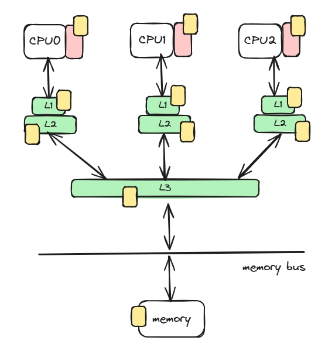

这是个*非常有启发性*的见解，log replication 所属工程领域关注的是高效顺序复制+ 有序的 log entry，Paxos 关注的领域是多节点如何就同一个值达成共识，所以 log replication + state machine 的一个更好方式可以是：  
*多个节点就谁可以成为 leader 达成共识，然后再由 leader 作为中心节点决定日志的全局次序，再保证将每个 log entry 同步复制到 majority nodes 上保证高可用。*

这种方式的缺点也很明显，就是存在写不可用区间，因为只有 leader 能处理写请求，而 P2P 形式的 Paxos 算法只依赖系统有 majority node 即可保证 availability。

为了提高算法的 understandability，不同于 paxos P2P 的 proposal 提交方式，Raft 将整个算法流程划分成了 3 个部分，先选举出 leader 节点，统一处理读写请求，再将写请求同步给其他节点。
1. leader election
2. log replication
3. membership changes

### 算法基础概念
* Role  
分成 leader，follower 和 candidate，后续拓展可加入 learner。
1. leader: 负责接收所有的读写请求，将写请求写入 log，并 quorum replicate 到 majority followers，相当于发起提案。
2. follower: 负责接收 log entry 同步，成功接收落盘后返回成功，相当于执行了一次投票。
3. candidate: follower 在一段时间没有收到 leader 心跳后，认为 leader crash，转变成 candidate 发起新一轮的 leader election。只有 candidate 才有选主能力。
4. learner：负责接收 log entry 同步，但是没有投票权，它的回应不计入 quorum 统计。

各角色间的状态机跳转简单如下：


* Term and Index
1. Term 
每次选出一个新主，term 都会递增，它是系统状态的 logical lock，同时也是一种 fencing 机制。

假如节点由于 GC Stop-The-World 机制导致系统出现脑裂，term 机制就可以避免 old leader 继续同步 log entry，因为 follower 会根据 term 大小拒绝 old leader 的同步请求。

由于系统中写请求只有 leader 才能执行，所以系统在 leader election 阶段是不可写的，在拓展的情况下可以保证系统的读能力。系统被不同 term 划分成不同的执行阶段。
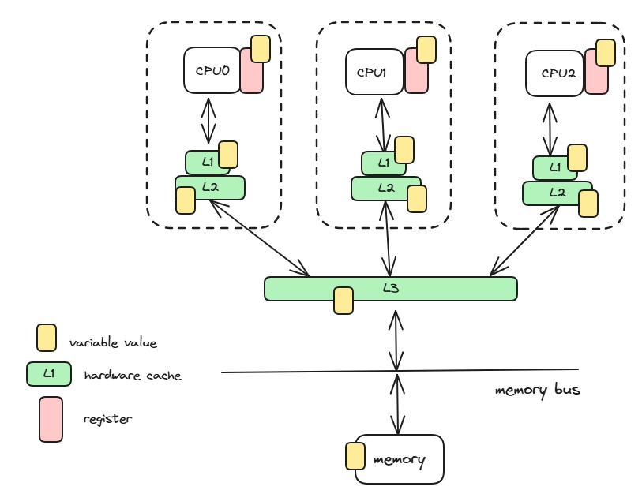

2. Index
index 表示在 log entry 在单条 log 中的次序，因为 Raft leader 唯一决定了所有 committed log entry，所以系统中存在一个 committed 全局唯一次序。

在下图的例子中，不同颜色的方块表示不同 term 的 log entry，而最上面的 log index 就是 log entry 在单条 log 中的 index。
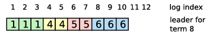

* Committed and Applied
这是算法中两个*非常重要*的概念，它们意思相近，但表达的是不同领域的概念。
1. committed：  
它属于 log replication 领域，表达的是 log entry 已提交。leader 对于每个写请求，当 write operation log entry 成功被 majority nodes 写到它们的 logs 中时，leader 认为该 log entry 被安全持久化了，这就是 **committed**。*不是被持久化到 log 中就是 committed*。

此时可以安全得将 write operation 应用到状态机中，状态机可以是内存 kv 对，或者带有 MVCC 机制的支持持久化的 KV DB，然后给 client 返回写成功。(如果状态机出错了呢？)

> NOTE:
> 在上面的说明中，有个**非常细节的地方**一定要注意：
committed 这个行为*第一时间只有 leader* 知道，followers 接收 log entry 并写到自己 log 时，它不知道这个 log entry 有没有 committed，因为 followers *没有全局视图*。leader 知道 log entry committed 之后，会在*下一次*同步 log entry 或者心跳中带上 leader 最新的 commitIndex，此时 follower 正式确认可以安全 apply 到 follower state machine 的 log entry 范围。
> 熟悉 MySQL 事务两阶段提交的同学也要注意这里的细微差别，log entry replicaton *不是两阶段提交*，commitIndex 是*异步*的，并且不会影响到 client 的应答，导致 Raft 后续 failover 后 re-commit 或者 rollback 模型也和 MySQL 不同。

2. Applied：
这是个应用领域的概念，log entry 只有*在 committed 的场景下*才会被 applied 到状态机中，状态机的形态在应用领域可以是非常多样的。

我们说 committed 和 applied 意思相近是说，在 leader 上，当一个 log entry is committed 时，也代表它会被*立即 applied 到状态机*中，再返回给 client 成功。后续 client read 就能立刻从 state machine 中读取到上一次 write 的值，所以正常情况下 commitIndex 和 appliedIndex 是一样的，
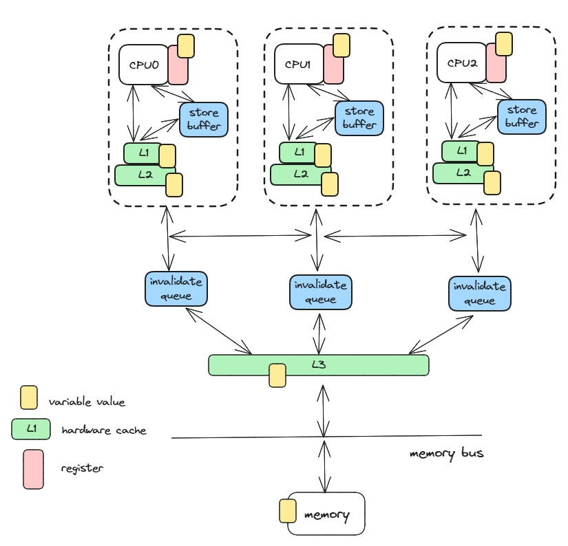

### 算法 safety 和 liveness
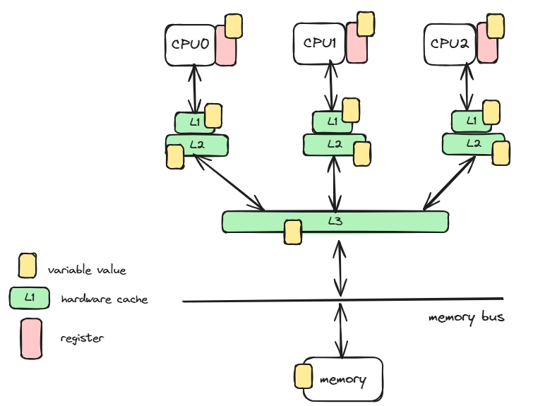
在算法属性中，保证算法 safety 的主要有以下 3 点：
1. Log Matching: 如果 2 个 logs 都包含 term 和 index 相同的 log entry，则 2 个 logs 中该 log entry 之前的所有 log entry 都是相同的。它要求是完整备份。
2. Leader Completeness: 如果一个 log entry 在某个 term committed 了，则后续所有更大 term 的 leader log 中都要包含这个 log entry。它表达的是 committed 是不可撤销的行为。
3. State Machine Safety: 如果某个节点已经 applied 了 given index log entry，那其他节点不可能 applied different log entry with same index。它是更加严格的 committed 不可撤销，要求 committed log index 位置是不可变更的。

Raft 的 liveness 基于 leader election 的 liveness 和 log replication 的 liveness。

### 算法流程
#### Leader Election
Leader election 由 candidate 发起，所有 candicates 和 followers 都可以投票。所有节点在初始化时都设置成 follower 机制，并设置 election timeout。如果超过 timeout 限制没有收到 leader 的心跳，就跳转到 candidate 角色，并发起 leader vote。

在 candidate 的每一轮中，它基于不同的场景做不同的动作：
1. 还没有接收到任何 vote request(包括自己的)，接收到 other candidate 的 vote request，并且 request term 等于 current term，则接受 other candidate vote request，并记录 current term voteFor。
2. 还没有接收到任何 vote request，投给自己，并向 majority nodes 发送 vote request，等待回应。
3. 接收到一个不小于 current term 的 leader 心跳，说明 leader 已经被选举出来，转变成 leader 的 follower。
4. 拒绝掉所有小于 current term 的所有请求。
5. 遇到所有大于 current term 的所有请求应答都被重置成 follower。

如果在本轮，已经接受了 vote request，则：
1. 如果投给自己，则判断 vote response 中能否达到 majority nodes 的认可，如果满足就转成 leader 角色并发送 leader 心跳给所有节点，否则等待本轮超时。
2. 如果投给别人，等待新 leader 心跳，有就转变成 follower，否则等待本轮超时。

Leader election 最大的问题是 **split vote**，当多个 follower 机会同时 timeout 时，容易出现系统不存在获得 majority votes 的 candidate，然后又几乎同时进入下一轮 leader vote。

为了解决这个问题，Raft 使用了随机化技术，即每个 candidate 都随机在一个时间范围内选择一个 election timeout，错开 candidate 的 vote request 发送时间。

从测试效果看，在一个 50ms 的区间内随机选择超时时间就能实现 513ms 的最差选举时间，而没有任何随机化的 leader election 由于 split vote 最快都需要 10s 才能完成选主。
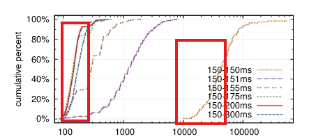

#### Log Replication
选主结束后，就到了顺序复制 log entry 阶段，这也是算法 safety 中的重头戏。

简单来说，leader 接受写的正常流程是：
1. leader 收到一个 client write operation；
2. 编码成 log entry，持久化写入 leader log；
3. 将 log entry 通过 RPC 发送给 majority followers；
4. 等待直到获得 majority followers 的成功回应；
5. 推进 leader's commitIndex，将 log entry apply to state machine 中；
6. 给 client write operation 应答成功；

> NOTE:   
> 另外一个需要关注的细节是：Raft 算法规定 leader 只能 append log，不能删除。它隐藏的另外一个影响是，不管是 leader or follower，log 中的 log entry 不一定都是 committed 的，也就是不一定能 apply 到 state machine。


在这个流程中，可以使用 batch request + pipeline 优化步骤3/4，提高系统整体吞吐和降低平均延迟，后面的描述就不再纠结于效率优化。

对于 follower 的正常流程：
1. 接收到 leader 的 log entry，term 一致则写入自己的 log 中，返回成功；
2. 提取 log entry 中的  leader CommitIndex 字段，推进自己的commitIndex，并把中间的 log entry apply 到 state machine 中；

我们在算法 safety 和 liveness 小节描述过 Raft 采用了一个非常严格的模型，要求日志是完整复制的，通过这种方式减小工程状态空间，严格限制不同节点可能发生异常的场景。
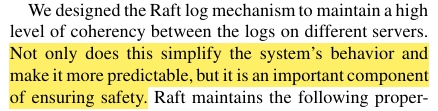

为了实现日志完整复制，就需要考虑不同的场景：
场景1：log entry 复制时，如何保证 follower 的 log 是完整复制？

场景2：对于当前 leader 写请求的应答流程，leader 并没有等 commitIndex 同步给 follower 就应答成功了，造成的问题是对于 new leader，如何确定一个合适的 commitIndex，从而保证不违反算法 safety 约束？根据系统参与组件(leader，client and follower)，进一步细分场景 2 的异常场景：
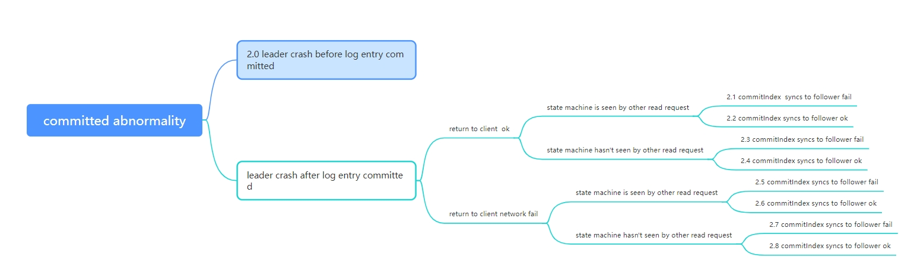
这里有些场景需要说明以下：
* 场景2.0: old leader 在 log entry committed 之前就 crash，old leader 和部分 follower 中有 uncommitted log entry；
* 场景2.3：old leader 认为 log entry committed，并且回复给 client 成功，但是 commitIndex 没有同步给 follower 就 crash，follower 中存在部分 committed but unknowledged log entry；
* 场景2.5：old leader 认为 log entry committed，回复给 client 网络超时了，但是状态机的最新状态被其他 read request 读到了，commitIndex 没有同步给 follower 就 crash;
* 场景2.7：old leader 认为 log entry committed，回复给 client 网络超时了，commitIndex 没有同步给 follower 就 crash;

场景3：大部分正常场景下，由于完整复制的限制，majority nodes 有 up-to-date log entry，但这些 log entry 有部分是没有 committed 的，导致多次 leader switch 之后，leader 和 follower 可能存在多种不一致。

进一步细分场景 3 的异常场景：
* 场景3.1：(a)(b) follower 部分和 old leader 重叠，但是都落后于 old leader；
* 场景3.2：(c)(d) follower 有最新的 old leader 数据，但是由于之前的 leader switch，导致还存在一些没有 committed 的 log entry；
* 场景3.3：(e)(f) follower 部分和 old leader 重叠，但是由于之前的 leader switch，导致还存在一些没有 committed 的 log entry；

针对不同场景，Raft 给出的解决方案如下：
* 场景1：  
做 log entry 复制时，在 RPC 中增加 consistency check 字段(prevLogIndex, prevLogTerm)，通过检查前一个 log entry 是否一致保证日志是完整复制的。如果不一致，说明 follower log 没有追上，需要同步历史 log entry。

* 场景2：  
这个场景之所以复杂，是因为分布式环境下多个组件 client，leader 和 follower 都参与 log entry 的确认。

这里需要解决的问题是，follower 成为 new leader 后，需要确保系统中 *committed log entry 一定不能变更*，uncommitted log entry 可以继续 commit or rollback，因为对于 client 而言都是网络异常错误，需要重试。

此时有 2 种选择：
方案1： follower 选举成为 new leader 后，通过 majority read 确定系统中 newest committed log entry，然后 erase 所有 uncommitted log entry;
方案2： follower 选举成为 new leader 后，提交之前所有 uncommitted log entry。这里可能出现一个合理但是奇怪的场景：client 提交写请求超时后，再查询发现没有执行成功，但是过了一段时间后发现又执行成功了，虽然写操作的幂等性可以保证重试的正确性。

Raft 选择的就是方案 2。

* 场景3：  
场景 3 的复杂之处在于应该如何选择 new leader 才能满足 Raft 的 Log Match/Leader Completeness/State Machine Safety 要求。
首先，由于 Raft log 是完整复制的，所以拥有所有 committed log entry 的 follower 起码拥有 up-to-date log entry，log entry 次序关系为：
```
for log entry A and B：
if term(A) > term(B): 
    => log entry A is newer;
else if term(A)==term(B):
    if index(A) > index(B):
        => log entry A is newer
```
这里其实了可以成为 new leader 的 follower 类型，比如下图中 S1/S2/S5 都可以成为 new leader，但是 S3/S4 就不可能，虽然它们实际也包含了 system 中所有 committed log entry，但 S1/S2/S5 成为 leader 更加合理。
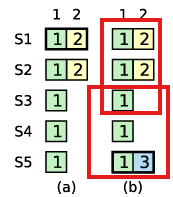

使用 up-to-date 规则选择 new leader 就需要考虑 old log entry 的 committed 问题，如果 new leader 直接按照正常的逻辑 re-commits old log entry，就可能发生 committed log entry 被撤销问题。

比如以下场景，
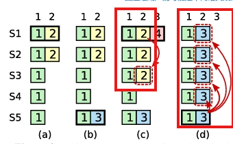
```
=> S1 根据 up-to-date 规则成为 new leader 
=> S1 re-commits old entry B(term2, index2)
=> S1 crashes after log entry B(term2, index2) is committed
=> S5 根据 up-to-date 规则成为 new leader
=> S5 commits old entry C(term3, index2)
=> S5 overwrites committed log entry B(term2, index2)。
```

所以 follower 成为 new leader 之后，不能直接 commits old log entry B，而是需要 commits a new log entry A to commit all old log entries preceding the new entry A。

一旦 new leader commits a new log entry A，那根据 up-to-date 规则，即使再发生 leader switch，next new leader 一定包含 new committed log entry A，则一定包含 old log entry B，*因为日志是完整复制的*。

对于为什么 "next new leader 一定包含 new committed log entry A"？ *因为选举需要的 majority vote nodes 一定会有一个节点和 committed 需要的 majority nodes 重叠*，此时 new leader 根据 up-to-date 规则不可能不包含 new committed log entry A。
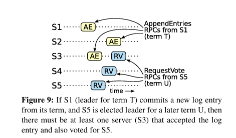

到这里，log replication 正常和选主切换后的同步流程都已经结束，更加严格 safety 验证使用了 [TLA+ 形式验证](https://web.stanford.edu/~ouster/cgi-bin/papers/OngaroPhD.pdf)。

#### Membership Changes
成员关系变更是实际工程应用中的一个常见场景，比如：
1. 某些机器永久下线，需要删除旧机器，增加新机器；
2. 为了提高/降低数据可用性，增加/减少数据备份数量；
3. 为了负载均衡或者解决热点问题，迁移 leader 到其他机器；

* Leader Transfer
由于 Raft 使用 up-to-date 规则选举 leader，所以当 administrator 向 prior leader 提交 transfer leader request 时，prior leader 会：
1. prior leader 停止接收客户端请求；
2. prior leader 将日志完全同步给 target server；
3. prior leader 发送 TimeoutNow request 给 target server，要求立即发起 election。由于此时正常场景下 target server 优先发起 vote request，所以大概率可以成为 new leader；

这个流程中也存在异常场景，比如 leader transfer 出现超时、  leader 提前 crashes 或者 target server crashes，由于 leader transfer 走的是正常的 leader election 流程，所以异常场景下导致的 leader election 还是会直接恢复 leader 读写能力，需要再次发起相同的流程。

* Add Nodes
增加或者减少成员的一个*关键问题*是： disjoint majorities。  
举个例子，数据备份需要从 3 备份变更到 5 备份。在没有特殊策略的情况下，不同 server 加载新配置的时间是不同的，存在某个时间段同时存在 $C_{old}$ 和 $C_{new}$。假设以下场景：
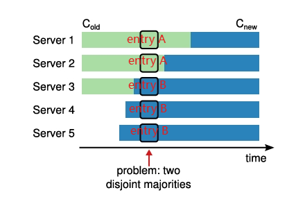

1. Server1($C_{old}$) 成为 leader；
2. Server1($C_{old}$) commits log entry A to Server1($C_{old}$) and Server2($C_{old}$), successful，因为是 3 备份；
3. Server1($C_{old}$) crashes；
4. Server5($C_{new}$) 成为 new leader；
5. Server5($C_{new}$) commits log entry B to Server3($C_{new}$), Server4($C_{new}$) and Server5($C_{new}$)，successful，因为是 5 备份；

这就是 disjoint majorities，没有违反 quorum 原则，但是新旧配置导致系统违反 safety 约束，committed log entry 被撤销。

针对这种不兼容的配置变更，如果你之前看过 [TiDB online DDL in TiCDC](https://maxshuang.github.io/dist-sql/tidb/online-ddl/2022/06/05/TiDB-Online-DDL-In-TiCDC.html) 这篇博客，就能感觉到大致的思路 --- *找到兼容的中间状态进行多步变更*。

论文提出的 2 种方案从不同的角度提出*兼容的中间状态*。
* **joint consensus**  
使用 $C_{old,new}$ 中间状态同时满足 $C_{old}$ 和 $C_{new}$ 要求，配置的变更状态变成 $C_{old}$ => $C_{old,new}$ => $C_{new}$。

举个例子：从 3 备份变更到 5 备份。  
* $C_{old}$：3 备份
* $C_{old,new}$： 3 备份+5 备份
* $C_{new}$：5 备份

分情况讨论：
1. 开始变更前
都是 $C_{old}$，正常。
2. 开始变更成 $C_{old,new}$，但还没有 committed
leader crashes 后，new leader 可能是 $C_{old}$ 或者 $C_{old,new}$。
    2.1. 如果 new leader 是 $C_{old}$，满足 3 备份同步要求；
    2.2. 如果 new leader 是 $C_{old,new}$，满足 3 备份+5 备份同步要求，此时 3 备份 majority nodes 一定有一个节点和 5 备份 majority nodes 重叠，所以没有 disjoint majorities 问题；
3. $C_{old,new}$ is committed
此时不管是否发生 leader switches，系统都是 $C_{old,new}$，满足 3 备份+5 备份同步要求。
4. 开始变更成 $C_{new}$，但还没有 committed
leader crashes 后，new leader 可能是 $C_{old,new}$ 或者 $C_{new}$。同理2的讨论，也没有 disjoint majorities 问题；
5. $C_{new}$ is committed
此时不管是否发生 leader switches，系统都是 $C_{new}$，满足 5 备份同步要求。变更完成。

* **single-server change**
不同于找到兼容的中间配置，*single-server change* 方案通过兼容的 majority nodes 解决 disjoint majorities 问题，也就是说原来的 3 节点配置 => 5 节点配置，变成 3 节点配置 => 4 节点配置 => 5 节点配置。

其中 3 节点配置 => 4 节点配置，必有一个节点同时存在于 3 节点配置和 4 节点配置 majority nodes，没有 disjoint majorities 问题。  
其中 4 节点配置 => 5 节点配置，必有一个节点同时存在于 4 节点配置和 5 节点配置 majority nodes，没有 disjoint majorities 问题。
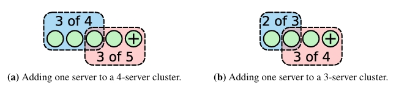

上面两个方案都是将配置变更写入 log entry，复用日志同步逻辑同步给集群节点，并且不需要确认配置变更是否 committed 就可以直接 apply 到节点的配置中，只要对应的节点接收到 config log entry 即可。

这两种方案都涉及到多阶段变更，并且新配置在 committed 之前可能因为 leader switch 被撤销，所以外部脚本持续监控变更流程。

新增节点的成员变更还有一个需要关注的问题：**新节点初始化问题**。
举个例子：3 节点配置(Server A,B,C) => 4 节点配置(Server A,B,C,D)。
3 节点配置的 majority == 2， 4 节点配置的 majority == 3，当配置从 3 节点配置 => 4 节点配置，如果原来的 Server A crashes，那整个集群的 majority nodes 就是 Server B,C,D，而此时 Server D 因为是新加入节点，log 远落后于 Server B,C，导致 log entry 无法 committed，因为 Raft log 要求完整复制。  

要解决这个问题，可以：
1. 如果引入 state machine snapshot 机制，可以设计先同步 snapshot 再开始追最新的 log entry。
2. 引入 learner


### 算法实现
前面描述了 Raft 算法的主要模块，我们具体用伪代码描述下不同角色的算法流程。


