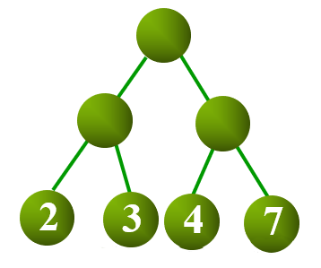

## Huffman Tree
本质上树的最小带权路径长度(**Weighted Path Length of Tree，WPL**)


$WPL=\sum_{i=1}^{n}{w_{i}l_{i}}$

## Huffman Algorithm
权值和最小，则要求权值越大的叶子节点路径越短。
Huffman 算法是一种贪心算法，不断选取集合中值最小的两个节点合并，合并后产生的新节点加入到集合中，直到集合只有 1 个节点为止。

如何证明这个贪心能最终得到最小带权路径？
有点难

伪代码：
```
PQ=|C|
cn=n

while(cn--) {
    l=ExtractMin(PQ)
    r=ExtractMin(PQ)
    n=Merge(l, r)
    Insert(PQ, n)
}
```

如何获取到编码表呢？
