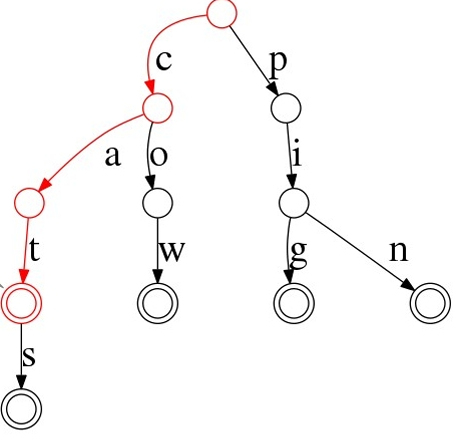
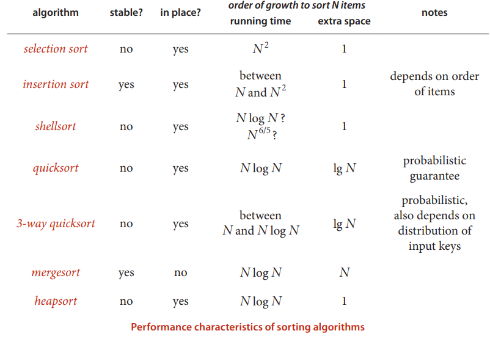
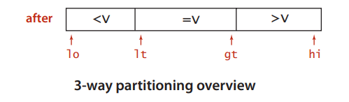

## Traversal 
O(N)


## Block Decomposition


对于这种区间求和问题，最直观且最正常的想法就是遍历。将操作独立开来看:  
1. 对于区间变更问题，使用差分数组的形式可以将 $O(N)$ 问题转换成 $O(1)$ 问题
2. 对于区间求和问题，可以使用前缀和数组的形式将 $O(N)$ 问题转换成 $O(1)$ 问题

但是对于交替操作，就需要存储更多额外的信息以便复用历史结果，降低时间复杂度。

解决这个问题的 intuition 的 2 个：
1. 区间加值或者区间减值如果要应用在区间求和上要转换成一个 lazytag，延迟操作。 
2. 为了实现快速的区间求和，可以使用一些已经保存过的区间和，然后再上面应用 lazy tag, 就可以复用之前的计算结果。

将这些 intuition 转变成 Block Decomposition 算法，就是预先对数组进行分块，然后维护分块的区间求和。当求解任意区间求和时，它可以转变成多个分块区间和的加法操作。



由于实际执行的区间加值操作可能只覆盖部分分块区间，对于这种情况，需要转换成复杂度为 $O(s)$ 的遍历操作。对于全区间覆盖，操作复杂度为 $O(1)$，可能覆盖的全区间个数为 $O(n/s)$。所以总的操作时间复杂度为 $O(n/s+s)$，当 $s=\sqrt{n}$ 时可以取到最小值。

```
#include <vector>

// two operations:
// 1. add, l, r, x
// 2. sum, l, r

enum Type {
    ADD,
    SUM,
};

struct Op {
    Type tp;
    int l;
    int r;
    int x;
};

int blockSize=0;
int blockCount=0;
std::vector<int> blockSum;  // for range sum
std::vector<int> lazyTag;   // for range add/sub

void add(std::vector<int>& array, const Op& op);
int sum(std::vector<int>& array, const Op& op);

std::vector<int> Calculate(std::vector<int>& array, const std::vector<Op>& ops) {
    // block decomposite the array
    int arrSize=array.size();
    blockSize=std::sqrt(arrSize);
    blockCount=(arrSize+blockSize-1)/blockSize;
    blockSum.resize(blockCount, 0);
    lazyTag.resize(blockCount, 0);
    for(int i=0; i<blockCount; ++i) {
        int start=blockSize*i;
        int end=std::min(blockSize, arrSize-start);
        for(int j=0; j<end; ++j) {
            blockSum[i]+=array[start+j];
        }
    }

    // do the operations
    std::vector<int> res;
    for(size_t i=0; i<ops.size(); ++i) {
        switch(ops[i].tp) {
            case ADD:
                add(array, ops[i]);
                break;
            case SUM:
                res.push_back(sum(array, ops[i]));
                break;
        }
    }

    return res;
}

// for Add:
// 1. cover the whole block, add the op.x*blockSize to the sum
// 2. cover only a part of block, do the range add
void add(std::vector<int>& array, const Op& op) {
    int lb=op.l/blockSize, rb=op.r/blockSize;

    // inside a single block
    if(lb==rb) {
        for(int i=op.l; i<=op.r; ++i) {
            array[i]+=op.x;
        }
        blockSum[lb]+= (op.r-op.l+1)*op.x;
        return;
    }

    // [l, (lb+1)*blockSize) 
    for(int i=op.l; i<(lb+1)*blockSize; ++i) {
        array[i]+=op.x;
    }
    blockSum[lb]+=((lb+1)*blockSize-op.l)*op.x;
    
    // [(lb+1)*blockSize, rb*blockSize)
    for(int i=lb+1; i<rb; ++i) {
        blockSum[i]+=blockSize*op.x;
        lazyTag[i]+=op.x;
    }

    // [rb*blockSize, op.r]
    for(int i=rb*blockSize; i<=op.r; ++i) {
        array[i]+=op.x;
    }
    blockSum[rb]+=(op.r-rb*blockSize+1)*op.x;
}

// for Sum:
// 1. cover the whole block, add block sum to total
// 2. cover a part of block, do the range sum
int sum(std::vector<int>& array, const Op& op) {
    // NOTE: can use static table to accelerate the query
    int lb=op.l/blockSize, rb=op.r/blockSize;
    int total=0;

    // inside a single block
    if(lb==rb) {    
        for(int i=op.l; i<=op.r; ++i) {
            total+=array[i];
        }
        total += lazyTag[lb]*(op.r-op.l+1);
        return total;
    }

    // [l, (lb+1)*blockSize) 
    for(int i=op.l; i<(lb+1)*blockSize; ++i) {
        total+=array[i];
    }
    total += lazyTag[lb]*((lb+1)*blockSize-op.l);
    
    // [(lb+1)*blockSize, rb*blockSize)
    for(int i=lb+1; i<rb; ++i) {
        total+=blockSum[i];
    }

    // [rb*blockSize, op.r]
    for(int i=rb*blockSize; i<=op.r; ++i) {
       total+=array[i];
    }
    total += lazyTag[rb]*(op.r-rb*blockSize+1);

    return total;
}
```

如果是查询多过修改，还可以通过维护分块内和分块间前缀和的方式，将查询复杂度降到 $O(1)$，但是修改的时间复杂度会有常数系数的增加。

除了区间和，分块算法使用于几乎所有的区间操作，比如查找区间中大于某个值的个数，查找区间中满足某个条件的值个数等等。

## BIT(Binary Index Tree)

树状数组是另一类通过增加空间维护额外信息提高算法时间复杂度的数据结构，不同于分块，它适用的场景是 **单点修改** 和 **区间查询** 。

我觉得它最大的特点是: 算法的 intuition 很抽象，但是实现超级简单。

我们违反正常的说明顺序，先看下 BIT 的实现。

```
#include <iostream>
#include <vector>
#include "catch.hpp"

using namespace std;

class BIT {
private:
    // start from 1
    vector<int> tree;
    int n;

    int lowBit(int x) {
        return x & -x;
    }

    int getSum(int index) {
        int sum = 0;
        while (index > 0) {
            sum += tree[index];
            // move to its children node
            index -= lowBit(index);
        }
        return sum;
    }

    void updateTree(int index, int val) {
        while (index <= n) {
            tree[index] += val;
            // move to its father node
            index += lowBit(index);
        }
    }

public:
    BIT(int size) : n(size) {
        tree.resize(n + 1, 0);
    }

    void update(int i, int val) {
        updateTree(i + 1, val);
    }

    // for 1 to i
    int query(int i) {
        return getSum(i);
    }

    int queryRange(int l, int r) {
        return getSum(r) - getSum(l - 1);
    }
};
```

我相信你的内心肯定非常疑惑，就这？ 核心代码只有不到 10 行，却可以实现一个 $O(logN)$ 时间复杂度，$O(N)$空间复杂度的 range query。再看看上面的 block decomposition, 空间复杂度为 $O(\sqrt{N})$，但是核心实现和边界处理要远多于 BIT。

BIT 的设计 intuition 我始终觉得非常难以理解，可以看到的一个点是它使用了前缀和来简化区间操作



https://cs.stackexchange.com/questions/10538/bit-what-is-the-intuition-behind-a-binary-indexed-tree-and-how-was-it-thought-a

非常抽象的数据结构，不知道为什么要这样设计？？？

普通树状数组维护的信息及运算要满足 结合律 且 可差分，如加法（和）、乘法（积）、异或等。

结合律：$(x \circ y) \circ z = x \circ (y \circ z)$，其中 $\circ$ 是一个二元运算符。
可差分：具有逆运算的运算，即已知 $x \circ y$ 和 $x$ 可以求出 $y$。
需要注意的是：

模意义下的乘法若要可差分，需保证每个数都存在逆元（模数为质数时一定存在）；
例如 $\gcd$，$\max$ 这些信息不可差分，所以不能用普通树状数组处理。

事实上，树状数组能解决的问题是线段树能解决的问题的子集：树状数组能做的，线段树一定能做；线段树能做的，树状数组不一定可以。然而，树状数组的代码要远比线段树短，时间效率常数也更小，因此仍有学习价值。

有时，在差分数组和辅助数组的帮助下，树状数组还可解决更强的 区间加单点值 和 区间加区间和 问题。

