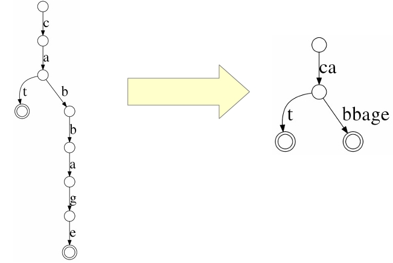

## Background

搜索表中有很多成员。

有些很直白，比如全映射表，在小的值域内直接实现 1：1 映射，非常直观得利用自然数和数组次序的对应关系，从而实现 O(1) time complexity。

有些用空间换时间，比如在值域很大的场景下，选择对 key hash 之后映射到一个小的数组中，hash key 冲突的部分用开链法或者线性/平方探测法保存，从而实现均摊 O(1) time complexity，但不提供有序访问操作。

有些则是用二分的思想，树家族是其中的庞大成员。从最基础的 binary search tree，到为了规避 O(N) worst time complexity 而提出的 binary balanced tree, 比如对左右子树的 depth or size 做约束的 AVL tree, Size Balanced Tree，自底向上生长的 2-3-4 tree/red-black tree，2-3 tree/AA tree 和 B 树家族, 利用堆性质的笛卡尔树和 Treap(heap tree), 以及利用程序局部性原理设计的 Splay tree 等等。

树家族为了实现 average/worst time complexity O(logN) 涌现出了一些非常令人 surprised 和 impressive 的思想，比如利用堆性质中 priority 代表在数列中次序的思想设计的 Treap，通过随机 priority 值打散元素的插入位置。又比如 Splay tree 通过将最近使用节点移动到根的方式，利用程序 locality 原理使得后续访问能更快找到对应节点。

但和设计中一直强调的 tradeoff 原理一致，对 average/worst time complexity O(logN) 总会带来**操作和理解上的 overhead**，要么付出更多的空间，要么付出更多的计算，而对 balanced 性质的追求在大部分树的实现中都要通过旋转操作保持平衡，旋转除了是计算上的 overhead，也是理解上的 overhead，所以调库就成为了软件开发者几乎唯一的选择。

有没有那种只要付出少许的空间代价，就能得到 **average/worst time complexity O(logN)**，并且提供 **range query** 的 search table？ 同时又很好理解，很好实现，可以自己上手做改造。

不好意思，现在还真有，就是 **[Skip List](https://15721.courses.cs.cmu.edu/spring2018/papers/08-oltpindexes1/pugh-skiplists-cacm1990.pdf)**。

## Skip List

### intuition
Skip List 绝对是那种令人锤头跺脚的数据结构，只恨如此简单的设计为什么不是自己想出来的。

它的 intuition 非常简单，有序链表可以实现 O(1) 插入删除，只能实现 O(N) 查找，那就使用类似倍增的思想，通过增加多层有序链表，先大范围搜索再逐层缩小搜索范围，从而实现 O(logN) 的查找，插入和删除。


非常简单直观的设计，所有的操作只要操作链表，不需要复杂的旋转操作，同时最底层还能提供 range query 这种能力。

### 原理
Skip List 是一种概率数据结构，在每次插入节点时会以概率 $p\in[0,1]$ 生成下一层节点，所以第 1 层存在的概率是 $p^0(=1)$，第 2 层概率 $p^1$，第 3 层概率是 $p^2$, 以此类推。

Skip List 中一个节点存在 i 层的概率为 $p^{i-1}*(1-p)$，在第 i+1 层停止了。

期望层数为： $\sum_{i=1}i*p^i*(1-p)=\frac{1}{1-p}$，因为 $p$ 常数，所以空间复杂度是 O(N)。

Average time complexity 为 O(logN)，具体见原始论文 [Skip List](https://15721.courses.cs.cmu.edu/spring2018/papers/08-oltpindexes1/pugh-skiplists-cacm1990.pdf)。

## 实现
Skip List 实现非常简短。


我们实现一个 Skip List 玩一下。

```
#include <time.h>
#include <stdexcept>
#include <vector>

class SkipList
{
private:
    static const int MaxLevel = 21;
    static const int Limit = 0x7FFF;
    struct Node
    {
        Node(int k, int v, int lev) : key(k), value(v), level(lev), forward(lev, nullptr) {}
        int key;
        int value;
        int level;
        std::vector<Node *> forward;
    };

public:
    SkipList(float p) : len_(0), p_(p), threshold_(Limit * p_), max_level_(1), head_(-1, -1, MaxLevel)
    {
        srand(time(NULL));
    }

    ~SkipList()
    {
        Node *n = head_.forward[0];
        while (n)
        {
            Node *next = n->forward[0];
            delete n;
            n = next;
        }
    }

    bool Insert(int key, int value)
    {
        std::vector<Node*> pres(MaxLevel, &head_);
        Node *pre = find(key, &pres, max_level_);

        if (pre->forward[0] && pre->forward[0]->key == key)
        {
            pre->forward[0]->value = value;
            return false;
        }

        Node *new_node = new Node(key, value, randomLevel());
        for (int i = 0; i < new_node->level; ++i)
        {
            new_node->forward[i] = pres[i]->forward[i];
            pres[i]->forward[i] = new_node;
        }
        ++len_;
        update_max_level(new_node->level);
        return true;
    }

    void Delete(int key)
    {
        std::vector<Node*> pres(MaxLevel, &head_);
        Node *pre = find(key, &pres, max_level_);

        if (!pre->forward[0] || pre->forward[0]->key != key)
            return;

        Node *del_node = pre->forward[0];
        for (int i = 0; i < del_node->level; ++i)
        {
            pres[i]->forward[i] = del_node->forward[i];
            del_node->forward[i] = nullptr;
        }
        if(del_node->level == max_level_)
            update_max_level();
        delete del_node;
        --len_;
    }

    int Get(int key)
    {
        Node *pre = find(key, nullptr, max_level_);

        if (pre->forward[0] && pre->forward[0]->key == key)
            return pre->forward[0]->value;

        throw std::out_of_range("key doesn't exists");
    }

    int Size() const { return len_; }

    bool Empty() const { return len_ == 0; }

private:
    int randomLevel() const
    {
        int level = 1;
        while (level < MaxLevel && (rand() & Limit) < threshold_)
            level++;
        return level;
    }

    // return the largest node that key < key in level 0
    Node *find(int key, std::vector<Node*>* pre, int max_level)
    {
        Node *n = &head_;
        for (int i = max_level - 1; i >= 0; i--)
        {
            while (n->forward[i] && n->forward[i]->key < key)
                n = n->forward[i];
            if (pre)
                (*pre)[i] = n;
        }

        return n;
    }

    void update_max_level(int level)
    {
        if (level > max_level_)
            max_level_ = level;
    }

    void update_max_level()
    {
        for (int i = max_level_ - 1; i >= 0; --i)
        {
            if (head_.forward[i])
            {
                max_level_ = i + 1;
                return;
            }
        }
        max_level_ = 1;
    }

private:
    int len_;
    float p_;
    int threshold_;
    int max_level_;
    Node head_;
};
```