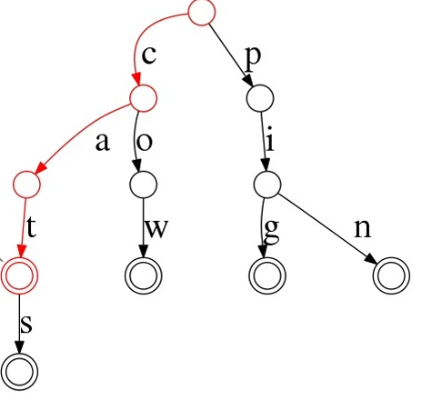

# Backgrond

排序是每个程序员学习算法的入门章节，除了教科书中提及的 selection sort, bubble sort, insertion sort, shell sort, merge sort, quick sort, heap sort, counting sort 和 bucket sort 之外，还有非常多的[排序算法](https://www.geeksforgeeks.org/sorting-algorithms/?ref=lbp)。

这篇文章不是为了涵盖所有的排序算法，而是为了回答一个问题： *可以无脑调用 C qsort 或者 std::sort 解决所有排序问题吗？*

答案显然是**不能**，因为他们不是稳定排序算法，需要保持原有的次序不变，需要调用 *std::stable_sort*。

# 算法特性

Stability 是排序算法的一个重要特性，在对数据的多个特性分别进行排序时，如果不使用稳定排序算法，就会导致结果出错，[<<算法4>>](https://algs4.cs.princeton.edu/home/) 中的一个例子就是：


常见算法的稳定性如下：


有意思的是，面对稳定算法，常见的算法并没有提供太多选择，在这个表中只有 insertion sort 和 merge sort 可以选择，非比较排序中的 counting sort 也是稳定的。

除了稳定性，我们还喜欢观察排序算法的其他几类性质：
1. in-place: 是否是就地排序，还是需要额外的空间
2. average time complexity: 平均时间复杂度
3. best time complexity: 最佳时间复杂度
4. worst time complexity: 最坏时间复杂度
5. space complexity

平时我们总会说 quick sort 是最快的排序算法，使用 quick sort 算法做任何数据的排序就可以了。这个说法的根据是 quick sort 是 in-place 且 average time complexity 为 O(NlogN) 的算法，并且根据经验看，他有比 heap sort 更小的常数系数。

这是不准确的说法，起码你看编程语言或者系统库提供的 quick sort 实现都很少是原生的 quick sort algorithm，更多的是一些 hybrid solution，在不同情况下使用不同排序算法，从而规避 quick sort O(N^2) 的 worst time complexity。

这其实是一件挺有意思的事情，里面有一些你在学习排序算法时*无意遗漏的小细节*。

比如：
1. selection sort 的 average exchange 是 O(N) 级别的，意味着对于*写代码很高*的介质，它可以是一个好的选择，即使它的 average time complexity 是 O(N^2)。
2. insertion sort 可以非常好得利用数据的原始分布，如果数据本身是 *sorted* 或者 *nearly sorted*，它就可以达到 best time complexity O(N)。这是 quick sort, merge sort 和 heap sort 等算法无法实现的 best time complexity，这是算法本身机制的问题。
另外，它的实现简单，没有优化时间复杂度的一些代码 overhead，比如维护 heap 之类的代码，所以在很多生产级别排序算法实现中，在数据小时会选择 insertion sort。
3. 相对于 quick sort, heap sort 虽然在常数系数上会相对大，但是 heap sort 的  worst time complexity 是 O(NlogN)，并且 space complexity 是 O(1)。
所以在一些小数据规模下，heap sort 能表现出比 quick sort 更好的 space efficiency 和 time efficiency。
4. merge sort 是 stable 的，同时 best time complexity 和 worst time complexity 都是 O(NlogN)，对于稳定算法来说真是好，唯一遗憾的是需要 O(N) extra space。
有一些 [inplace merge sort](https://www.geeksforgeeks.org/in-place-merge-sort/) 的实现，比如 SGI STL 的 stable sort 是使用的就是 inplace 算法：
```
template <class _RandomAccessIter>
void __inplace_stable_sort(_RandomAccessIter __first,
                           _RandomAccessIter __last) {
  ...
  __inplace_stable_sort(__first, __middle);
  __inplace_stable_sort(__middle, __last);
  __merge_without_buffer(__first, __middle, __last,
                         __middle - __first,
                         __last - __middle);
}
```
这些算法中有些只能达到 average time complexity O(N*(logN)^2) 或者 O(logN*N^2)。
5. 在不同类型的比较算法设计中，可以观察到一些有意思的结构，O(NlogN) 级别的算法总会在每个 round 共享一些结构信息，比如 merge sort 和 quick sort 这种 divide and conquer 算法，每个 round 都在使得整体数据表现得 roughly sorted。对于 heap sort，其核心思路更是不需要一开始就完全有序，只需要 roughly sort 就可以以 O(1) 的时间复杂度获取到最大或者最小值，然后再以 O(logN) 的时间复杂度新增或者删除元素。

# quick sort 算法实现
quick sort 算法作为基础算法，无论是理论还是实现都被研究得很透彻，但是 quick sort 算法并不是那么容易实现，里面有很多细节，需要一些技巧才能快速从零开始实现 quick sort 算法。

quick sort 算法的逻辑在任何一本算法书中都可以找到，我们主要是仔细看下里面的细节。

首先算法的大体流程是一个 divide and conquer，通过 partition 找到一个中间位置，使得 vec[lf, cut-1] <= vec[cut+1, rt]，然后再分别对左边和右边调用相同的流程。 
```
void quick_sort(int* vec, int lf, int rt) {
    // precheck
    int cut = partition(vec, lf, rt);
    // recursion
    quick_sort(vec, lf, cut-1);
    quick_sort(vec, cut+1, rt);
}
```
对于核心的 partition 函数，大致的逻辑是：
1. 使用某种方式选择一个基准值 pivot。
2. 使用左右指针分别从数组的左右边界开始向中间收缩，将小于 pivot 的元素调换到左边，大于 pivot 的元素调换到右边。
3. 当左右指针相遇或者左指针大于右指针时流程结束，可以找到一个中间位置 cut，满足 partition 要求。

我们看第一个错误实现的版本：
```
// check range: [l, r]
int partition_wrong(int *vec, int l, int r)
{
    // select the first element as pivot
    int pivot = vec[l];
    // Q1: ??? Should I use [l, r] or [l, r+1) ??? 
    int i = l, j = r;
    // Q2: ??? Should I use i<j or i<=j ???
    while (i < j)
    {
        // [NOTE]: left point stops when meeting element that is larger than pivot
        while (vec[i] <= pivot && i <= j)
            i++;
        // [NOTE]: right point stops when meeting element that is not smaller than pivot
        while (vec[j] > pivot && j >= i)
            j--;
        // Q3: ??? Should I use i<j or i<=j ???
        if (i < j)
        {
            // exchange the left and right element
            exchange(vec, i, j);
            i++;
            j--;
        }
    }

    // two conditions: i==j+1, i==j
    // Q4: vec[j]<=pivot ?? vec[j]>pivot ??
    return j;
}
```
在这个错误版本的实现中，看起来我们实现了 partition 的逻辑，但是起码我们遇到了 4 个细节问题：
1. Q1： 我们应该使用开右边界还是闭右边界？ 平时我们习惯了使用开右边界，在这个场景下如何选择？
2. Q2： 在使用闭右边界时，while 结束的标志是 i\<j 还是 i\<\=j？ 标准是什么？
3. Q3： 应该是 i<j，因为 i==j or i>j 都不需要交换。
4. Q4： 在这个版本的实现中，循环结束会遇到 i==j，但是并不确定 vec[i] 和 pivot 的关系，那就无法确定 i 就是我们需要的 cut。比如：
```
1. vec[i] > pivot
比如： 数据 [4, 1, 3, 5, 6, 7] 会在 5 的地方出现 i==j。
2. vec[i] <= pivot
比如： 数据 [4, 1, 3, 2] 会在 2 的地方出现 i==j
```

我们依次解决这些问题，从而获得一个更加正确的版本：
```
1. Q1: 对于右边界问题，它关系到的只是遍历停止条件的问题，原则是遍历时没有遗漏元素。
开右边界则为 for(int l; l<r; ++l)；
闭右边界则为 for(int l; l<=r; ++l)；
2. Q2： 和 Q1 相关，
如果 Q1 为 [l, r), 则 Q2 使用 while(l<r); 
如果 Q1 为 [l, r], 则 Q2 使用 while(l<=r)，否则会导致 l==r 时对应的元素没有被访问; 
3. Q3： 使用 i<j，才能满足交换条件
4. Q4： 结合 [l, r], 则只有 i==j+1 会导致 while 循环结束，此时 vec[j] <= pivot，否则 i 不可能越过 j。为了保证算法正确性，需要交换 vec[l] 和 vec[j]，保证 j 可以作为 cut 返回。
```
修改后的代码：
```
// check range: [l, r]
int partition(int *vec, int l, int r)
{
    int pivot = vec[l];
    int i = l, j = r;
    while (i <= j)
    {
        while (vec[i] <= pivot && i <= j) i++;
        while (vec[j] > pivot && j >= i) j--;
        if (i < j) exchange(vec, i++, j--);
    }

    // one conditions: i==j+1, vec[j]<=pivot, vec[i]>pivot or i==r+1
    exchange(vec, l, j);
    return j;
}
```

对于这个流程，只能说是硬写，通过判断各种边界保证不会出现 corner case，非常容易出错，过程也很痛苦。

其实一个比较好的做法是利用[<<算法导论>>](https://edutechlearners.com/download/Introduction_to_algorithms-3rd%20Edition.pdf)中的循环不变性质(loop invariant)保证算法正确性，简单说就是保证算法初始状态符合一个算法性质的约定，每次循环都保证约定成立，这样算法最后就是正确的。

对于 quick sort algorithm，我们构造一个 invariant，比如：
```
check range: [l, r]
[l, i)<=pivot, [i, j] not sure, (j, r] > pivot

```
``` 
// check range: [l, r]
int partition(int *vec, int l, int r)
{
    int pivot = vec[l]; 
    // Initial: keep the invariant: [l, i)<=pivot, [i, j] not sure, (j, r] > pivot
    int i = l+1, j = r;
    while (i <= j)
    {
        while (vec[i] <= pivot && i <= j) ++i;
        while (vec[j] > pivot && j >= i) --j;
        if (i < j) exchange(vec, i++, j--);

        // Here: after each loop
        // 1. if i<=j, keep the invariant because of the exchange
        // 2. if i>j, vec[j]<=pivot, vec[i]>pivot or i==r+1, so keep the invariant
    }

    // one conditions: i==j+1
    // exchange l, j to keep vec[j]==pivot, still hold the invariant here    
    exchange(vec, l, j);
    return j;
}
```

另外一个教科书中的写法：
```
// check range: [l, r]
// keep the invariant: vec[l..i) <= pivot, vec[i, j) not sure, vec[j..r] >= pivot
int partition(int *vec, int l, int r)
{
    int pivot = vec[l];
    int i = l, j = r + 1;
    while (true)
    {
        // [NOTE]: use "<" instead of "<=" to keep the partitions more balanced
        while (vec[++i] < pivot) if (i == r) break;
        while (vec[--j] > pivot) if (j == l) break;
        if (i >= j) break;
        exchange(vec, i, j);
    }

    exchange(vec, l, j);
    return j;
}
```

对于有大量重复元素的数组，使用 3-way quick sort 可以实现 Average Time Complexity O(N) 的性能，该算法排序后大致的样子是：
 
实现 3-way quick sort 也可以依赖 loop invariant:
```
// keep the invariant: vec[l..lt] < pivot, vec[lt+1..i-1] == pivot, vec[i, gt) not sure, vec[gt..r] > pivot
void quick_3way_range(int *vec, int l, int r)
{
    if (l >= r)
        return;

    int pivot = vec[l];
    // assign lt, gt, i to keep the invariant
    int lt = l - 1; // less than boundary
    int gt = r + 1; // greater than boundary
    int i = l;
    while (i < gt)
    {
        if (vec[i] == pivot)
            ++i; // expand the range of pivot
        else if (vec[i] < pivot)
            exchange(vec, ++lt, i++); // expand the range of less than, since original vec[lt+1]==pivot, we need to skip vec[i]
        else
            exchange(vec, --gt, i); // expand the range of greater than, since original vec[gt-1]!=pivot, we need to recheck vec[i]
    
        // Also keep the invariant here.
    }

    quick_3way_range(vec, l, lt);
    quick_3way_range(vec, gt, r);
}
```

# 应用中的 sort
Python 标准库中的 sort 采用 [TimSort](https://bugs.python.org/file4451/timsort.txt) 算法，它的 best time complexity O(N)，average time complexity 和 worst time complexity 都可以满足 O(NlogN)。

C++ 标准库中的 std::sort 使用 [Introsort](https://www.geeksforgeeks.org/introsort-or-introspective-sort/)，这是一个结合了 quick sort, heap sort 和 insertion sort 的方案，保证算法的 worst time complexity 满足 O(NlogN)。其算法流程上大致为：
1. quick sort 不断划分 partition。
2. 当 quick sort 递归深度过深时，采用 heap sort，前面我们说过 heap sort 也是 inplace 的算法，并且 average time complexity 和 worst time complexity 都是 O(NlogN) 级别的，只是常数系数会相对大。
3. 当整个数组 nearly sorted 之后，采用 insertion sort 排序。

SGI STL 中实现如下：
```
template <class _RandomAccessIter>
inline void sort(_RandomAccessIter __first, _RandomAccessIter __last) {
  ...
  if (__first != __last) {
    __introsort_loop(__first, __last,
                     __VALUE_TYPE(__first),
                     __lg(__last - __first) * 2);
    __final_insertion_sort(__first, __last);
  }
}

template <class _RandomAccessIter, class _Tp, class _Size, class _Compare>
void __introsort_loop(_RandomAccessIter __first,
                      _RandomAccessIter __last, _Tp*,
                      _Size __depth_limit, _Compare __comp)
{
  while (__last - __first > __stl_threshold) {
    if (__depth_limit == 0) {
      //!!! [NOTE]: This is the heap sort
      partial_sort(__first, __last, __last, __comp);
      return;
    }

    //!!! [NOTE]: tail recursion version of quick sort
    --__depth_limit;
    _RandomAccessIter __cut =
      __unguarded_partition(__first, __last,
                            _Tp(__median(*__first,
                                         *(__first + (__last - __first)/2),
                                         *(__last - 1), __comp)),
       __comp);
    __introsort_loop(__cut, __last, (_Tp*) 0, __depth_limit, __comp);
    __last = __cut;
  }
}
```