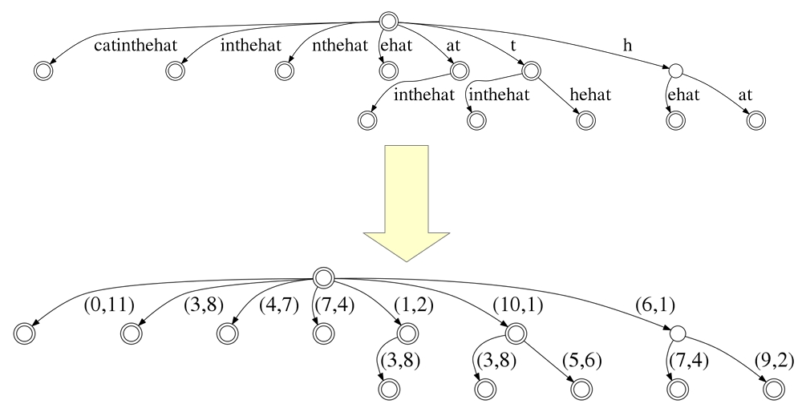

# Trie

# Radix Tree(improved Trie with compressed path)

# Radix Tree for number
// split the number into hexadecimal digits
// 4 bits for a hexadecimal digit
// For efficiency, radix trees for strings are often implemented this way!
// balance the depth of tree and the number of empty children node

# Suffix Tree for substring search of a single string

