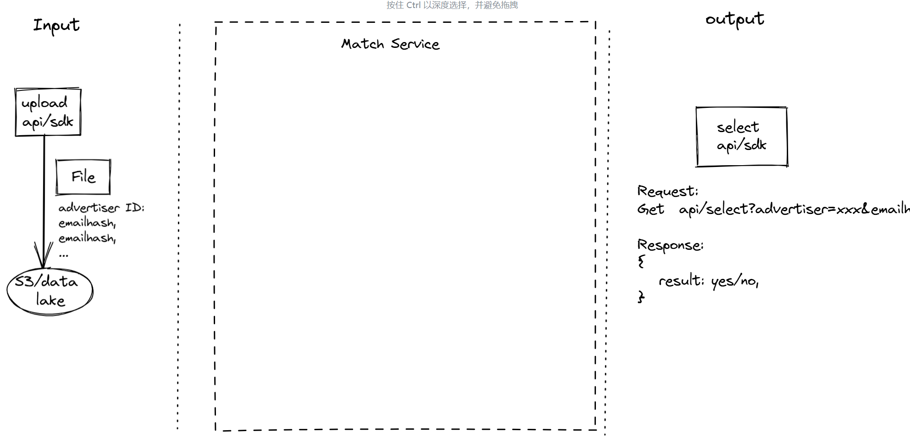
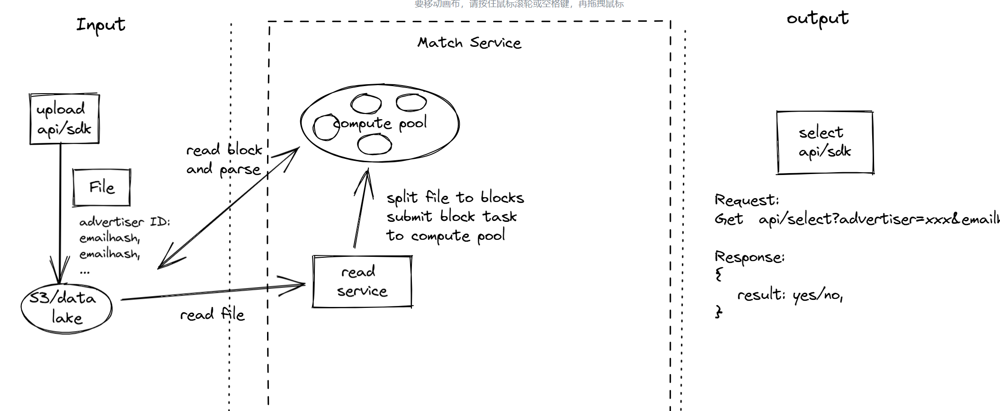
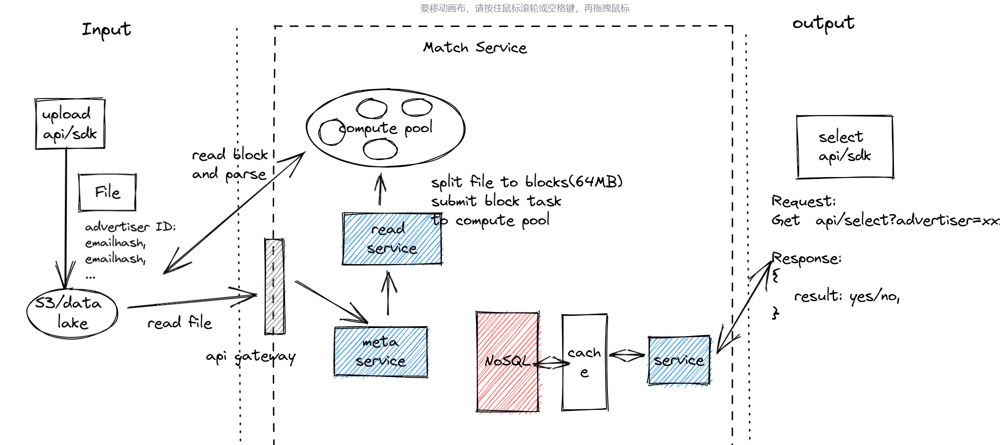
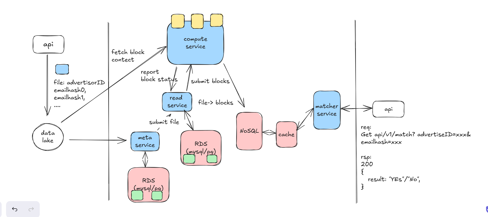
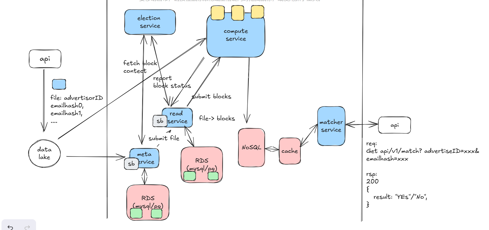
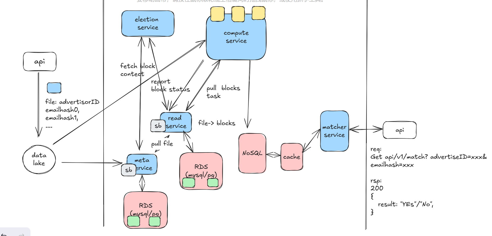
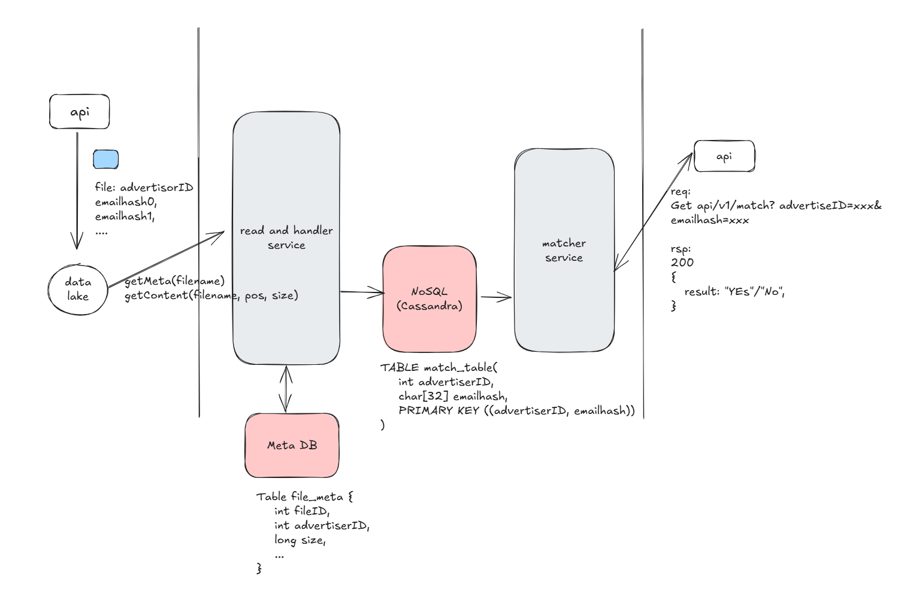
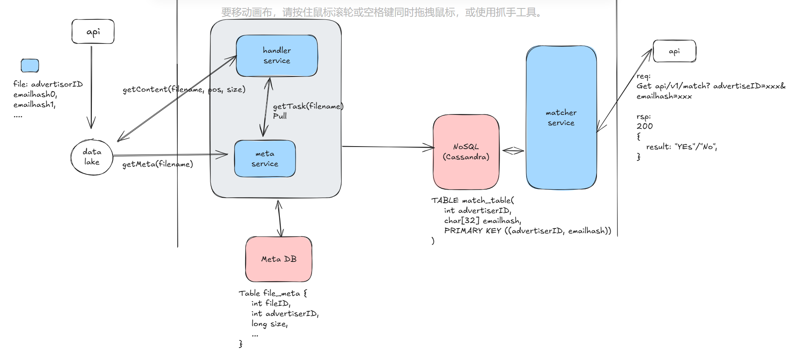
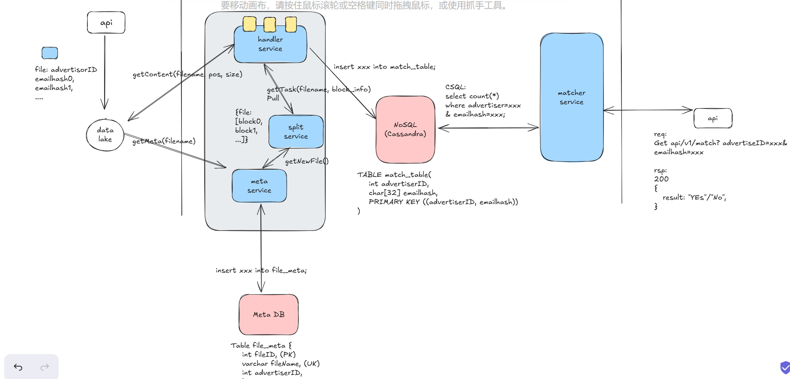
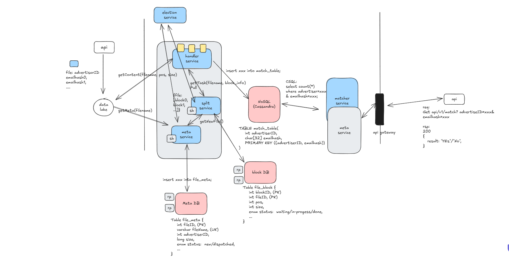

挑重点的讲，踩了很多红线，包括 system design 和 BQ。好处是 system design 问对了关键的问题，BQ 还没有，只是发现了 cultural shock。

System design:
1.之前所有的 system design 都做错了，因为要么是知道了答案，要不就是完全不知道答案，导致做得一套糊涂。但是却不知道为什么会做的不好。没法主导 system design, 但是我又知道很多细节。
    a.比如 Tiktok 的设计表情包统计
    b.比如 Rokt 设计广告商用户过滤功能
2.其实还是讲述和解释问题的方式问题。
a.类似解决一个 leetcode 问题，如果评价标准是 ac 的时间和时间空间排名，那最好的方式就是拿到题就直接做。但这是面试时候应该采取的方式吗？还真不是，coding interview 一般在名字后面跟着 problem solving，后面的 problem solving 就很讲究了。我们可以看下一个合理的 coding interview 的方式方法：

1. 拿到一个相对模糊的问题，paraphase problem, 尝试去解释问题，确认是否有理解上的偏差，可以通过举例的形式对模糊的点进行对齐，或者一些对 cornercase 输出结果有影响的 semantic
2. 确定输入输出的形式
3. 至少提出 2 个解决方案, 然后分析他们的 pros/cons, 确定不同方案的 Time/Space complexity, 然后用一个例子 walk through 下大致的流程，确认双方都理解后向面试官确认需要实现哪个方案
4. 开始实现，构造一个正常和异常的 test case，保持一个相对合理的速度，边实现边解释，使用合理的 variable name/function name/或者合理的 comment，保持实现方案的可读性和 clean
5. 实现完后主动用一个例子 walk through 全部的逻辑，检查和修改实现过程中的一些小错误
6. 如果可以就运行，跑通基础用例，然后和面试官讨论可以增加什么样的 testcases, 通过构造 testcases 检查实现上的一些异常场景

从上面可以看出，一遍 ac 虽然很重要，但只是一个流程中的一个步骤，对于一道 hard 级别的题，基本就在考察智力了，没法考查到 problem solving 能力。这里的 problem solving 非常具体，
1. 尝试去界定一个模糊问题的具体功能，
2. 然后确定输入输出形式，
3. 定义好问题后提出不同的解决方案，分析方案的 pros/cons，确认方案是否被双方都认可和理解，不理解就尝试用例子去解释清楚，
4. 实现的过程中保持持续有效沟通，让面试官 follow 你的实现，这样在陷入困境的时候，面试官因为提前知道了答案或者他没有面试的紧迫感，所以可以给 hint，及时解决问题。
5. 用例子再次 walk through 整个实现，保证基础用例的处理逻辑是正常的。
6. 沟通讨论可以的 cornercases, 展示对实现代码质量的经验。

以上就是在整个 coding 过程中除了智能之外，可以展示的 problem solving 能力，通过持续的沟通界定问题，然后对齐双方的理解，最后解决了一个问题，而不是 ac a question。

写到这里，几乎之前我所有的 coding round 都做得不算规则正确，除非面试官本身就是只在乎考验你的智力水平或者展示他的智力优越感，不然跳过全流程的沟通直接  ac a question 本身就是有缺陷的结果，因为针对 coding round 正常情况下都是有多个得分点的。

我经历过非常多轮的 coding round, 大部分是 easy/medium, rokt 也经历了白板。我在没有意识到这个问题的前提下，直接 ac 很多问题，某些时候展示了上面流程中的部分步骤，面试官给的评价也很高，一部分说明可能他们也不一定知道他们具体想要找到是候选人的什么能力，可能纯粹想要知道你的计算机智商是否在线。

这中间，即使是最简单的 LRU 其实按照上面的标准，我回答的都不好，因为我知道标准答案是什么，所以大部分时候我解释完标准方案后，就直接写了 ac。回想起来，有些我没有界定输入输出的类型和形式，有些没有界定异常场景应该怎么返回，抛异常还是返回 -1，有些因为本身没有 cornercases 所以没有讨论 cornercases。可能最大的原因还是我已经知道了答案，这反而限制了我和面试官交流展示 problem solving 的能力。

我在和 atlassian 的一轮 coding 中，意外做得很好，我也提前知道应该怎么实现，但是他给的问题实在是太模糊了，导致我被逼着去界定问题。回想起来，原来那个面试官知道他在找什么。但是在那一轮，我犯了另外一个错误，就是他在讲话的时候因为 accent 的问题，其实我不知道他在说问题，错过了讨论不同解决方案的时机，或者说他认为更好 solution 的 hint。Anyway, ship has sailed.

好了，我们把关注点转到 system design 上面，这个我的问题更大，因为它不再是一个可以直接 ac 的问题，它本身就是一个非常模糊的问题，如果你没有意识到你需要在 system design 中展示什么样的能力，而是直接尝试去给出一个答案，那问题就更大了。因为 system design 我认为，重要的点不是只给出一个好的解决方案，而是展示你是如何得出一个好的解决方案的，并在这个过程中充分向面试官展示你的 problem solving 能力，沟通能力和工程技术水平。

这个非常有意思，我在和 Rokt 工程师的 system design 设计中，陷入了被动，但是我还是不知道为什么会这样子，我的技术视野和工程项目经验已经足够重头设计一个新的系统，甚至我觉得我在某些领域的准备超过了面试我的人，那为什么我还是没法主导一个 system design? 这里肯定存在某些我 miss 掉的关键问题，那这个正确的问题是什么？

直到我后来收到了 Rokt system design 的反馈, 再联想起来在面试过程中我的表现和 interviewer 向我提出的问题，我终于明白了他们在问出一个大问题的时候，想要听到的是什么答案。有种恍然大悟的感觉，一下子就把之前学到的东西都连通到了一起。

再进一步讲之前，还有一个很重要的问题，就是为什么我之前没有意识到这个问题。这个也很有趣，我在面试前准备了非常多的常见 system design 面试问题，也和朋友 mock 了很多次，在真实的面试中遇到过准备过的问题，也遇到过没有准备过的问题，而结果就是，准备过的问题答得还不错，但是有些细节被问到的时候不清楚，没有准备过的问题都答得很差，就是两个极端，正是这两个极端让我忽略了去问到底什么是正确的问题，直到我去 Rokt 现场面试，遇到了一个完全没遇到过的问题，然后从头到尾一起讨论出了一个解决方案，然后拿到反馈。

回到正题，我下面要去解释：
 “重要的点不是只给出一个好的解决方案，而是展示你是如何得出一个好的解决方案的，并在这个过程中充分向面试官展示你的 problem solving 能力，沟通能力和工程技术水平。”

 也就是说，system design 的结果图是你结合自己设计水平对一个需求的分析，沟通，持续改进的最终展示而已，你如果跳过了中间的过程，直接给出一个结果，类似 leetcode 那种，是不合理的，因为你给出的设计是在某些需求下的产物，那个需求除了包括功能需求外还包括一些非功能需求，比如对延迟的要求，对系统可用性的要求，不是这场面试的需求。

 那这场面试的需求我怎么知道？很简单，问！就是沟通，问到清楚为止，因为这个就是 system design 的一个得分点，它就是想要你向它问问题。这里的问是有层次的，因为我们不可能一次性在开头把所有的问题都问清楚，有些问题是你满足了基本需求后，再继续加一些功能或者非功能的需求，所以就是有层次地问。

 问的问题本身就包含了你对工程的理解。

 从我的面试复盘开始，让大家更清楚得看到为什么我的那场面试是不成功的。

 首先从给我的一个很模糊的问题说起，Rokt 是做推荐的，他们遇到的问题是，当用户购买一个服务，比如 ticketmaster 的某场演唱会时，Rokt 会推荐相关服务给用户，但是他们会遇到说推荐一些不合理的相关服务给用户，比如用户已经是某个商家的 5 折会员了，还推送这个商家的 7 折方案给用户，用户肯定不会购买的，需要解决这个问题。

https://excalidraw.com/#json=BR9f04bZYnX4kEp6MAQ5t,i_d7RfJxIiZ3ICsdXi2r3Q

上面是业务级别的问题，对应的输入输出为：
1. 输入: advertiser 的文件，文件中只有一个列，对应的是这个广告商所有的注册用户
2. 输出：有个 api 会给 match service 发送 get 请求，查询 advertiser+emailhash 是否存在

请开始设计！

ok, 新的设计问题，非常贴近实战，没有遇到过，有点慌，但是要强装镇定。
首先观察问题，问题本身表述得比较清晰，左边的 input 和 output 描述得也比较清晰，左边 input 的基本意思是为了去重，需要客户自己的会员列表文件，存在一个 data lake 里，match service 需要自己去取，右边 output 是 api 主动向 match service 查询，然后 match service 返回结果。

因为是系统设计，所以 data lake 具体是什么不重要，需要知道的是它可以提供文件的 metadata 和 content。

好了，下面到我问问题了，标准起手式，Funtional Requirement 和 Non-Functional Requirement, 前面那个已经描述得很准确了，就要确定后面那个：
1. input 中 advertiser 的规模和单个文件的规模是什么量级的，面试官说好问题，说明问到了点上，
=> advertiser 是 10k 量级
=> 单个文件大小从 10k~100GB 都可能
=> emailmd5 256 bits
=> 处理后可能存储的总数据量 100GB/ 32B = 3 GB = 3*10^9

怪不得说问到点上了，主要是单个文件可能非常大，我首先想到的是这里需要 match service 能提供并行计算和计算扩容的能力。
中间结果的存储数据量超过了单机 mysql/pg 的存储量，可能需要考虑 NoSQL 之类的数据库。

2.  output 中查询的 rps 是什么量级的？ 10K 级别

到这里我问完了第一阶段的问题，主要是针对输入输出的，我觉得还算合理，其实还有很多可问的问题，后面会说，但是在第一阶段我觉得可以不问了，因为可以先解决最基本的问题，再慢慢增加问题，保持沟通。

这是我接下来给出的设计，考虑到有超大文件的存在，我的大致感觉是需要一个 read service，读取文件 metadata, 然后将一个超大文件切分成 block, 可能是个 64MB 之类的，然后传给 compute pool 做并行读取和并行处理。

这里其实我就做错了一个事情，后面再说。提出我的大致处理方案后，我就受到了 challenge, 从这里开始我感觉自己就处于下风了，因为这里可能就开始偏离面试官预设的答案了。他挑战我说 read service 大概在做什么，read service 怎么知道有新的文件，为什么要切分成 block，为什么是 64MB, 如何处理切分后导致的数据断掉的问题。

这里问问题的方式已经有点 challenge 了，其实这些问题里有不同的含义：
1. 他提出的问题是他之前工作中遇到过的，所以他完整考虑了一遍，很多细节比你熟，现在我一下子提出一个宽泛的东西，他觉得细节不够，不知道这中间是怎么实现的。同时，面试官也做了很多假设在这里，他假设我是知道 data lake 或者 S3 提供了什么样的语义接口，但是我知道 S3 的原理没有用过 S3, 导致了我解释中出现了另外一个被他 challenge 的点。

这里另外一个更深的隐藏内容是面试官和面试者不对等，面试者拿到一个新的问题，要从头想起，而面试官已经想过了，所以在心里上他会错误认为说这些问题这么明显，为什么你没有注意到呢？你应该考虑到的。起码站在我的角度上不是，很多细节是需要深入思考后调整的。但是这里其实还有另外一个问题，就是深入细节太早了，这是有问题的。

我回到他的 challenge, 说我印象中 S3 是会直接将文件分 block 存储，所以可以直接通过 S3 拿到某个文件的 block 信息，然后进行 dispatch。这种回答他就不理解了，不知道我在做什么，因为我和他都在开始假设了，他假设我知道 data lake 的接口语义，我假设 S3 是这样实现的。这里一通解释后，终于对齐了，datalake 提供直接读取文件 metadata 能力，没有读取 block 能力，同时支持可以从某个 position 开始读取文件。

看到这里就知道，其实是需要知道面试官假设了什么，基本上每个人每时每刻都在假设，假设空气是可以呼吸的，假设大家的 background 是差不多的。面试官经常要求面试者通过询问的方式去掉一些假设，但是他们自己本身就可能在假设，这就是人。

对于 64MB 的问题，大致解释了下，一个合理的 block 大小，处理起来也快。这里其实没有个准确的值，可以提供参考而已，比如方便一些 data lake 内部的 block 对齐之类的，没有标准答案。对于可能会切分文件中的记录，的确是会，然后我注意到了文件的每条记录都是 md5，就解释可以对齐，也算是过了。其实这里还是可能有问题，除非有数据清洗，不然可能切分后数据也没法对齐。这就是小细节了，面试官思考过，我没有，所以我被 challenge 了。

到了如何获取新的文件的问题，这的确是个问题，所以我加了个 meta service 在中间，复杂查找 new file, 然后分发给 read service 再切分。这里的问题是我一开始没有问清楚 data lake 的语义接口，主要还是没想好自己要什么，也可以在这个阶段问，比如 data lake 有没有主动推送新文件的接口，比如 pub/sub 到某个目录下，增量监听之类的，这是基础操作，但是在 system design 中要沟通好接口。

讲完这里我觉得大致设计完了前面的部分，然后跳去了设计后面的部分，为了支持 output, 我增加了 NoSQL database, cache 和 matcher service, 解释了用 NoSQL 是因为中间存储的记录数多，需要 scalability, cache 是为了加快访问速率。然后解释了下 DB schema 之类。

这可太符合我的起手式了，NoSQL+cache+service, 这里就又开始踩雷区了。被疯狂 challenge, 几个问题：
1. 为什么要增加个 cache? 其实是个好问题，增加 cache 提升接口 performance 和 reduce latency 是个工程设计的常识，突然被问我有点不知道他问这个问题的目的是什么。于是我回答了一个 normal 的答案，这显然不可能是他想要的。我补充说因为现实生活中大部分数据和访问都天然遵循 2-8 原则，所以我们需要 cache。他接着问为什么要做这种用户访问分布的假设，还有就是为什么要假设我们需要提高 api performance。到这里才是它想表达的点:

1. 我没有要提高 api 性能的需求，如果有这种需求你应该先和我沟通，比如问我 api 查询的前端延迟需要在什么量级，比如 50ms 内，比如原来是 100ms, 需要优化到 50ms 内。
2. 为什么一定是加 cache? 比如从 100ms 到 50ms, 为什么一定是访问存储的延迟导致的？不是其他模块导致的。

被问到这里，基本上我就知道最终的结果不好了。因为我其实已经 miss 了很多 system design 的得分点：

1. 没有沟通，就做假设，假设 api 访问要优化延迟，假设延迟是由存储引起的
2. 讲 system design 缺失了层次感，cache 这块其实由非常多可以讲的，但是在一开始就讲有点不合适，它应该是另外一个功能需求比如优化性能里讲的，注意那其实是另外一个子问题，而现在其实我最上层的问题还没有讲完，不应该深入的。

这里为了做一些找补，我还是讲了一些 cache 相关的技术知识，比如使用 api gateway 的 metric 统计接口延迟，使用 opentrace 做后端系统的分布式追踪从而确定延迟优化点，比如从 api gateway 的 log 中统计数据分布从而确定最佳的 cache capacity, 比如 cache 可以放置的不同位置(client/CDN/server)和 geo+data locality 特性，比如 cache 的读写方式(read aside/read through/write through 之类的)，cache 的不同 eviction policy(LRU/LFU/TTL) 之类的，cache 的雪崩/穿透等问题

其实我想充分展示我的技术积累深度，其实这些都是非常好的 topic, 可惜有些前置条件没做好。最后他在这个部分的评价也很客观，就是太容易深入细节，描述的方式过于跳跃。

我有反思为什么我没有这种思考习惯，一个原因还是我过去的工作经历大部分是 data infra, 问题本身界定得很清楚，只需要通过设计去提升它的拓展性/可靠性/可用性和性能。没有过多经验和 pm 去做反复的沟通，反复界定问题，优化性能对我老说可能就是一个日常的工作，因为我的成功可能就是我提升了多少性能，而不需要去问为什么我要提升性能，我提升性能满足了什么需求。这的确是一个思考方式上的缺陷。

好了，后半部分解释得差不多了。我觉得设计可能结束了，面试官继续 challenge，因为这是他之前做过的，所以很多细节上的问题他知道。他让我描述整个系统的高可用是怎么保证的，我描述说 matcher service 是 stateless 的，可以通过 api gateway 做水平拓展，NoSQL 也是可以 horizontally scalable 的，也可以水平拓展，并且有高可用的多备份设计，从而保证了系统的高可用。这个部分其实我完全忽略的前半部分模块，主要是我没有意识到前半部分没有设计完就跳过了。
面试官把我的注意力拉到了前半部分，让我介绍下 meta service/read service 和 compute service 的高可用设计，并且让我描述下前半部分的 dataflow。

被 Q 回来后我意识到我又一次失去了面试的主动权，主要的原因还是在 system design 的设计中我没有有层次得去讲系统是怎么设计的，数据流是怎么流动的。而高可用设计其实也已经是另外一个子问题了，它是在整个系统在满足基础功能，数据流成功从 input 流向 output 后，再去考虑的系统健壮性问题。其实包括 cache 在内的性能问题其实也是另外一个子问题，应该在另外的阶段去描述。

对于这个问题，其实我的问题主要有 2 个：
1. 描述层次混乱导致我没有去做 deep dive
2. 我在之前做 system design 练习的时候，没有去关注一些实现上的细节，比如数据流的流动方向，不同 service 间依赖的接口，service 的高可用是怎么做的，service 之间的 push/pull 关系是怎么在 tradeoff 的。

开始描述实现细节

我解释下这个图中的设计，这里我的问题是部分高可用设计是不断被 Q 才设计的，不是主动设计的，这也是做的不好的点。我们具体看下：
1. meta service 以监听或者周期扫描 data lake 的方式获取 new file，并且写到 database 中，这里因为 advertisor 的数量级只有 10k，所以文件的量级也只有 10k, 用 mysql 或者 pg
就可以，然后用主从复制做高可用。

这里我其实只描述了 new file 存储的高可用，没有描述 meta service 本身的高可用，这里可以想象 meta service 的职能其实是单点，它本身是 stateless, 但是其实我们不需要有多个 meta service，其实也可以有多个 meta service, 但是场景上需要是上游数据量非常大，需要通过分区的方式并行化，在这里不用。为了保证它的高可用，其实需要一个 hot standby + leader election 支持，或者依赖 kubenetes 的 deployment 自动 failover 能力也行，这里的 tradeoff 有一些，比如需要解决潜在的多个 meta service，数据层是否可以有某种方式比如 unique key 去重。我自己还是倾向于系统中有个选主中心，它还可以做 pub-sub 和 service discovery 之类的。

2. read service 其实工作也不多，meta service 把 new file 信息转发给它，它负责切分维护 {file, [block0, block2, ...]} 这些元数据，为了它的高可用，也要将这些信息存储在 db 中。read service 其实也可以不用水平拓展，因为计算量不算大，通过 hash 的方式水平拓展也行。

3. 这里的高可用问题其实还有，我面试的时候因为新拿到这个问题，考虑得不是很细节充分，这也正常。现在想起来，dataflow 从 data lake -> meta service -> read service -> compute service。compute service 它接收数据输入/计算/把结果写到 DB，由于输入输出都是 immutable 的，所以单个任务的 failover 可以通过任务重新提交的方式重新运行。

如果 compute service 自己就有能任务高可用能力，比如自动 failover, 像使用 spark/flink 这种 compute engine, 其实就不用 read service 承当 failover 能力。

如果团队比较小，在原来的系统架构中没有这么复杂的计算角色，可以自己用进程池或者线程池实现一个简单的 stateless compute service, 把任务的持久化和 failover 能力转移给 read service。

如果 compute service 的某个 compute unit crash 了，就需要 read service 能感知，去重新提交任务，这里 read service 其实需要知道每个 block 的 status, 就需要 compute service 支持任务反馈机制，比如 read service 提供 rpc 回调接口。read service 需要某些超时机制，周期扫描 block 列表，检测超时后重新提交 block task。

对于 read service, 在这个场景中，也可以是 single role, 使用 hot standby+leader election 的方式保证高可用，还是不是水平拓展了，因为它有管理职责。

到这里，我们详细讨论了这些 service 的 failover 能力，考虑了他们是否需要是 stateless 或者有管理职责。从计算和存储上讨论了高可用。

这里需要注意的是，system design 讨论由于层次从上到下，所以其实在不同的 subproblem 中我们会给 service 增加不同的 interface, 提高他们的表达能力。

差点漏了讲一个细节，面试官问我，meta service 到 read service 这里应该是用 push 还是 pull 的形式。我听到的时候其实有点懵，我充分理解 push 或者 pull 的交互方式，只是我因为一直觉得 push 是 service 直接的正常交互方式，所以没有细想这个事情。我只是描述了 push/pull 方式的 pros/cons，就算是回答了它的问题。

其实可以回答得更好的，在这个场景中 push/pull 都可以。

当我们想用 push 的时候，意味着我们想要上游的消息尽快且及时发给下游，这里有时效性问题的考虑(比如突发通知)，也有上游数据安全的考虑(比如上游可能 crash, 丢失了通知)，所以需要下游接收/处理并存储，下游可以在短时间内获取到消息，或者可以同时存储消息实现上游信息的最终一致性。同时，下游遇到的问题就是，由于上游 push 速度很快，它可能需要存储消息才行，可能要持久化消息，不然它自己 crash 了消息也会丢失。也就是说 push 模式基本都需要接收者有存储消息的能力，并且会有 backpressure 机制，接收者需要这个负反馈机制告诉发送者，我不行了，处理不过来，少发点吧。
比较经典的例子就是 TCP，当接收者 CPU 处理不过来，消息在内存中堆积，就需要通过 response 中的 win 参数告诉发送者，下次少发点过来。
像 TIDB CDC 在接收 region raftlog 的时候，其实也是用的 push，因为上游 TiDB 的 raftlog 是有 GC 的，对于 CDC 这种依赖 raftlog 的下游而言，TIDB 需要尽快将 raftlog event 发送给 CDC。 CDC 自然需要中间存储，遇到处理能力受限时也会触发 backpressure, 这个时候在监控上就可以看到，TIDB 给 CDC 发送 event 的速率极慢，甚至可能掉 0。

pull 模式就很简单了，数据存储在上游，下游有空闲处理能力就自己来 pull。这种实现模式简单。

另外一个需要注意的点是，由于 push 会将消息推送给不同的下游，对于一些任务处理的场景，相当于多个下游都有自己的任务队列。这里可能出现的问题就是，有些下游处理能强但是没有任务了，有些下游处理能力弱但是任务却排队很严重。对于这种场景，可以改用 pull 将任务队列统一放在上游，或者使用 task stealing mechanism, 调节下游的任务队列。

对于现在这个场景，因为 meta service 和 read service 都有持久化储存能力，并且上游的文件量级实在不大，所以没有太大的区别。

我们的 system design 变成了这个样子。

设计到这里，其实系统已经相对完整了，满足了基础功能，高可用。

接下来就是其他问题了，比如性能问题，分析某些 api 的 dataflow 路径，然后使用 cache 优化延迟。这里的性能问题就可以讨论对 cache 的 capacity estimation, 是否使用 CDN，如何根据 CDN 的存储成本和网络回查成本，计算最佳的存储方案之类的，这部分就需要和面试官沟通，看他是否有兴趣了解，也可以主动展示工程能力。

面试官在最后提出了一个有意思的问题，就是系统的端到端延迟问题，比如 input 中客户在提交文件到 data lake 之后，到 output api 查询需要等待多长时间。这个问题其实背后想要问题的是：在有限的机器资源情况下，当我们遇到业务高峰期时，系统的端到端延迟如何保证？是否满足 PM 的预期？比如要求端到端延迟需要在 2 小时内，客户是否有不同的处理优先级？

这个问题是个非常有意义的问题，首先机器资源是有限的，根据不同的公司规模和业务场景，可用计算资源和存储资源都有限，对于这个文件处理而言，一个 100GB 的文件并行处理需要的计算量很大，可能实际在升级 K8s 资源时需要排队等待好久。另一个就是一个客户提交了 100GB 文件，另外一个客户提交了 10K 的问题，结果发现 10k 文件的客户需要等待前面的客户处理完才行，这就不合理，可能回阻塞非常多的客户，导致 break 大量的端到端 SLA。

这是架构中非常经典的问题，数据和行为是天然分级的，不管是计算机中的 data locality 和 access locality，还是虚拟内存机制，再到 cache 机制，在到公司的大客户/中客户/小客户。在有限的资源下，需要某种优先级机制，或者轮转机制。

对于这个场景，我们可以给不同的 file 设置不同的 Priority，可以使用 priority(waiting time, customer wight, file size) 周期更新 file 的优先级。在有优先级的场景下，compute service 和 read service 使用 pull 机制会更加合理，在自己有能力处理的时候才拉取任务。同时 compute service 也需要提供某种 priority pool 机制，保证不能同时被一个超大文件的 block task 全部占用，要保证有些小文件有机会被优先快速处理。 

到这里为止，就是我认为这个 system design 得到的一个比较合理的结果，这个中间其实我犯了很多错误，不熟悉是一方面，另一方面是整个 system design 讲故事的方式错了。

https://excalidraw.com/#json=zdMyzvDBt0GiARb79FBWM,bS1z9FclYbD_OjUgYgVU7A

在最后结尾这里，让我重新去讲这个故事，分层分不同子问题得去讲这个故事。

1. 首先这个系统得的 FR 已经非常明确了，只有一个功能，就是读取 data lake 数据，然后支持 api 查询

2. 对于 NFR, 比较直观的就是输入的数据规模(10k advertiser, 10k~100GB) 的文件大小，output 的 api 请求频率(10k rps)。这里对于输入输出，最不清晰的就是 datalake 提供的读取语义，这个需要在设计之前问清楚，提供什么样的接口(getMeta(filename), getFile(filename, pos, size))。datalake 有没有潜在的 api 限频或者带宽限制之类的(这是 S3 之类系统提供的用户资源管控能力)。

3. 进一步的 NFR，可能是端对端延迟限制(2 个小时内)(这个基本所有的系统可能都关注)，api 延迟限制(50ms 内，这个可能涉及到跨城跨国跨大陆的服务访问延迟)，高可用系统，高拓展系统

4. 基于前面的沟通结果，做一些 system capacity estimation, 包括可能的存储选择，计算的可拓展性之类的。
10k 的文件(可以用 RDS 存储元数据)，超大文件可能需要分块，做并行读取和并行处理。处理后的记录数在 100GB/32B=3*10^9, 需要 NoSQL
支持。

5. 到了这一步，就专注于解决第一个问题，就是满足 FR(读取 data lake 数据，然后支持 api 查询)。我们最好一个问题一个问题解决，
像 cache 其实是性能优化问题。
high-level design + dataflow, 这个部分是非常高层的设计，目的是阐述在 dataflow 在系统中是怎么流动的，大模块间
依赖什么样的接口，比如 RESTful 或者 rpc, 大致的形式是什么样的，存储用的 data schema 是怎么样

这是这个阶段的 high-level design 图，我们只关注非常大的 service 划分，中间的存储，此时可以 walk through 整个 dataflow
, 从而给面试官一个整体的感受，对于大 service 之间的交互，可以在这个阶段设计出交互用的 api/rpc/database schema(pk/uk设计)/SQL。此时一个
满足基础功能的大致系统就一目了然。

6. 基础功能其实还没有设计完，因为 read_and_handler service 太宽泛了，我们考虑再细化一下，处理文件需要 2 个步骤，先
获取新文件并读取文件的元数据，然后再读取文件的内容，解析文件内容写到 NoSQL 中，所以这里我们对原来的 service 再拆分一次。
 
我们划分出了 meta service, 它负责监听 datalake newfile 并写到 DB 中。有个 handler service 负责读取文件内容并解析存储
到 NoSQL 中。
到这里其实可以 deep dive 下 meta service 和 handler service 的设计，因为我们知道单个文件可能 100GB 或者 1TB，所以
我们可以讨论下这里的性能优化子问题，就是如何并行化大文件的读取和处理。这里可以讨论的问题非常多，取决去很多 context, 需要
做很多 tradeoff, 这些都是可以和面试官交互的点。
比如：
1. 如何做大文件处理的并行化？此时就需要根据文件的元数据做 block 切分，比如切分成 64MB 的 block。为什么是 64MB？因为
大小适中，不会长时间占用单个 compute engine，太小会产生太多的 file-> blocks metadata。
2. compute service 如何设计？这里需要考虑到是需要 stateless compute service 还是 stateful compute service。如果
是小团队，可以直接设计 stateless process/thread pool 做并行处理，将 failover 转移到 meta service 中, 并且需要建议采用 pull
的方式，保证不存在 task skew。
如果是大团队，可以复用 spark/flink 之类的 compute engine，这些可以自动做任务 failover，同时也有任务持久化能力，对 metaservice
的各种要求就很低，都转移到了 compute service 中，可以采用 push 的方式。
failover 其实是另外的子问题，可以不在这里过多讨论，等讨论到的时候再考虑，避免丢失焦点。

同样对于每个拓展出来的 service, 我们尽量定义他们的交互接口，可能使用交互方式 push/pull, 或者 RESTful/RPC, 这里没有对错。

7. 重新审视下这个设计，已经满足了基本功能，端到端 dataflow 流向非常清晰，接口设计和 data schema 设计合理可用。那我们
跳到下一个问题，如何保证服务的高可用。这个我觉得比性能优化要重要一点，所以先讲，毕竟先可用，高可用，再考虑快的问题。
服务的高可用主要包含 2 个大的模块，计算的高可用和存储的高可用。
计算的高可用分 2 种大类型:
1. stateless compute，只管计算，比如 api gateway，只做鉴权之类的，自己本身不产生状态，只可能查询其他状态做计算。这类高可用
就是在前面加个 proxy, ip 层/应用层/传输层都行，加上 health check 和 load balancing 就行。
2. role stateful compute，就是具备管理职责的计算节点，这类节点需要维护任务状态，一般在整个系统中是角色单点。为了保证它的高可用
一般采用 hot standby + leader election 的 solution。

存储的高可用也分成 2 大场景：
1. 单机的 MySQL/PostgreSQL 存储，一般用 master-replica 架构保证高可用，并且读节点可以做 stale read
2. 分布式存储，一般自带高可用能力，比如 Cassandra, MongoDB， ES, TiDB 等。他们有不同的读写语义，在架构选型的时候
可以根据场景对 consitency/latency/recency 的要求具体选择，这又是一大块内容。

回到我们这个场景，
1. 对于 service 的高可用: matcher service 最简单，属于 stateless compute，不产生状态，直接在前面加 proxy/gateway。meta service 属于
有管理职责的，所以我们用 hot standby + leader election。split service 也有管理职责，它需要负责 blocks 的维护, 包括 blocks 的
处理状态之类的，所以它也属于有管理职责，考虑用 hot standby + leader election。
2. 对于任务的高可用：比如 file 是否在处理中？ blocks 是否在处理中？compute service 是否能自动做 failover？failover 的职责要由哪个负责？
都可以讨论。这里假设 compute service 是完全无状态的，就要 split service 维护 blocks 状态，超时后重新提交。此时就要设计对应的 database schema
和超时机制。另外一个就是单个 block 任务挂了的幂等问题，因为文件都是 immutable 的，所以可以重新拉起任务并依赖 DB 的 pk/uk 去重。
3. 对于存储的高可用，使用 RDS 的可以采用 replica 架构做主备切换，NoSQL 本身具备高可用能力，设置数据 replication 副本数即可。

这就是我们解决高可用问题后的最新架构图。

8. 接着往下走，可以考虑解决性能和可拓展性问题。
性能问题: 这个非常依赖沟通，性能问题有部分可以通过提高程序效率实现，有部分需要增加成本实现，比如增加 cache/CDN 之类的，所以需要通过
沟通确认清楚是否有需求。另外一个重要的点就行，不要无脑加 cache, 需要通过系统 metric, 比如 api gateway log 或者 opentrace 的形式搞
清楚在整个 dataflow 中，造成性能问题的瓶颈在哪里，再解决。
可拓展性问题: 考虑 critical path 上，当未来请求量激增时，如何做更多的 stateless compute 设计，减少 single role 的计算量。

9. 再接着往下走，可以考虑如何做系统不同模块间的解耦，可以考虑如何设计业务级别的优先级支持，如何满足端到端的 SLA，如何根据天然的 2-8
原则做数据分层存储，做 cost saving, 如何在 geographical 的服务设计满足服务 SLA, 这些都是值得讨论的话题，也可以体现出你的工程深度。

讲到这里已经结束了。其实我觉得一个好的 system design 应该是分层次得阐述和解决问题，尽量每次解决一个问题，让双方都能非常 focus 在一个点
上讨论，从上到下逐渐 deep dive, 并且不断喜欢之前设计的 interface 和 database schema。通过这种方式，实际上就是在实现一个满足需求的系统，
中间所有的 service 间交互方式，所有的存储 schema 已经被你设计出来了。

最后一点，system design 有时候就是不对等的，拿到一个没见过的需求，自然在设计中难免有考虑不周的地方。面试官经常会有先入为主的观点，为什么
我能想到的他想不到，他可能技术不行，考虑问题不全面。Anyway, 这就是面试，努力改进自己的表达方式，提高沟通能力就行，也不期待 1 个小时设计一个完美的系统。

哦哦，还没完，面试中另外一个和 system design 的大坑是叫你介绍你的过往经验，我之前都是一上来就画之前 project 的架构图，还画的很漂亮，结果掉了大坑。
如果你听懂了我之前讲的内容，就应该知道这种 system design 的考察目标都是你是如何通过沟通的方式解决一个实际需求。
那么在介绍 project 的过程中，
1. 你就要首先解释清楚你为什么要做这件事，这件事解决的事什么问题，界定一个或者多个具体的问题。
2. 清楚定义你的输入输出，端到端是个什么样的结果
3. 讨论你的项目的一些 NFR, 比如支持的任务量，延迟要求，高可用要求，高拓展要求等等
4. 以系统设计的表述方式描述你系统中的不同 service 和 role，描述你为什么要这样设计和选择。描述你对计算存储的选择，比如元数据存储之类的。
5. 在上面的过程中要把 dataflow 画出来，dataflow 是如何流转的。
6. 满足基本功能后，介绍你的系统是保证 service, task，storage 的高可用，如何做的性能优化，如何处理一些异常的系统问题(GC stop)
7. 此时基本上你就就会得到一个你系统的架构图，基于这个架构图增加一些额外的拓展，比如 add-ons。

这个过程中，基本就在向别人解释为什么你会得到这样一个设计，你从哪些人那里得到了哪些信息，从而让你决定做这样的 tradeoff,
这部分就是在 sell your problem solving 能力，communicaton 能力和工程能力。

https://excalidraw.com/#json=EfritKfDLQ8N317PXYhFx,GMxdb8aTwQEkAtu53ni-mQ